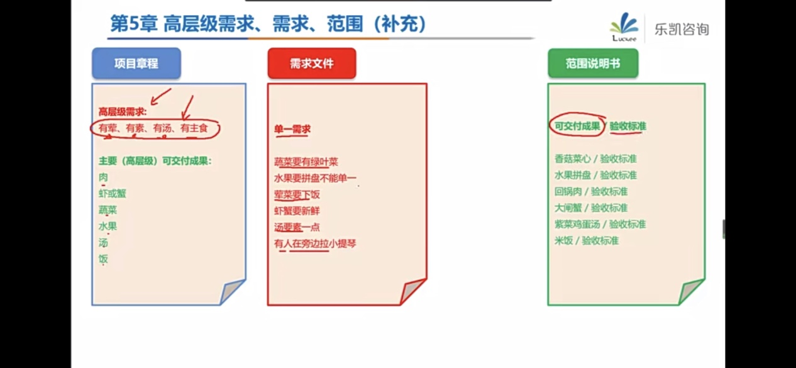
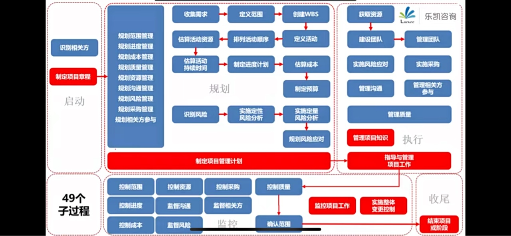
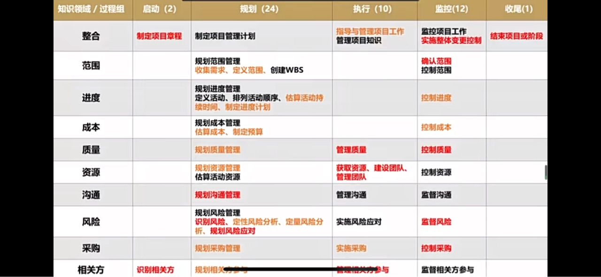
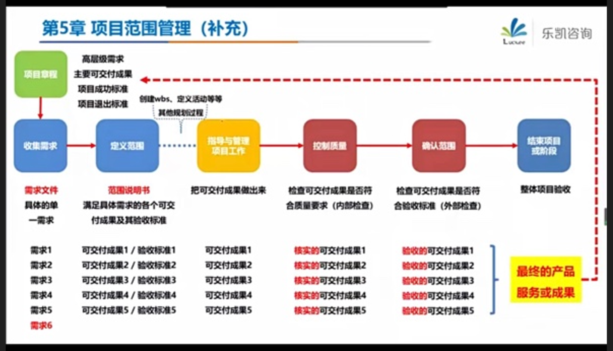

# PMP

培养万金油式的管理能力。

PMP推崇的是一种管理理念，用科学的方法管理项目，通过系统的学习，可以培养万金油式的基本能力，如团队管理、风险把控与预防、进度控制、沟通协调以及领导力等。

当接到一个项目或任务时，拥有专业的知识，才能更清楚项目的脉络，把握做项目的路径。

**范围说明书：可交付成果/验收标准**

**49个子过程**

**十大知识领域**

实际验收：确认范围（验证范围）

形式验收：整体项目验收

## 第一章 引论

考点：

裁剪：确定过程、输入、工具、技术、输出和生命周期阶段的恰当组合。

项目：为创造独特的**可交付成果**（产品、服务或成果）而进行的临时性工作。

**项目的独特性：**

* 独特性带来不确定性（风险）。
* 独特性造成裁剪的尺度不一样。

* 开展项目是为了通过可交付成果达成目标。
* 可交付成果：独特、可核实（QC、测试、检查（抽检））

**项目的临时性：**

项目有明确的起点和终点。

临时性并不意味着持续时间短。

项目临时，结果持久。

**项目驱动变革：**

项目驱动组织进行变革：从商业角度来看，项目旨在推动组织从一个状态（当前状态）转到另一个状态（将来状态）

**项目创造商业价值：**

**项目管理：**

将知识、技能、工具与技术应用于项目活动，以满足项目的要求。

项目是组织创造价值和效益的主要方式。

为了在全球经济中保持竞争力，公司日益广泛利用项目管理，来持续创造商业价值。

有效和高效的项目管理应被视为组织的战略能力。

有效的项目管理可以帮助：

* 管理制约因素（例如范围、质量、进度、成本、资源）（范、进、成   多快省）
* 平衡制约因素对项目的影响（例如：范围扩大可能会增加成本或延长进度）

项目（单身狗）：“方式”正确。需求、开发、试运行、验收。

项目集（家庭）：相互关联。强调协调和依赖。“方式”正确。相互之间的配合。

项目组合（小区）：资源争夺。它们不一定彼此依赖或者相关。强调优先级。“选择”正确。体量最大。

**运营**

婚礼：项目

婚后的日子：运营

项目管理的关键要素：

* 项目的**生命周期**：**开始项目  组织与准备  执行项目工作 结束项目**
* 项目阶段
* 阶段控制关口
* 项目管理过程
* 五大过程组
* 十大知识领域

**项目生命周期：项目从启动到完成所经历的一系列阶段**。这些阶段之间的关系可以顺序、迭代（不同的版本）或交叠进行。

### 开发生命周期

定义：**项目生命周期内**与（产品、服务或成果的）**开发相关的**一个或多个阶段。

开发生命周期可以是：预测型、迭代型、增量型、适应型、混合型。

**预测型**生命周期：**瀑布型  计划驱动**

**需求阶段 设计阶段  开发测试阶段  试运行阶段 上线交付**

范围、进度、成本在早期阶段就确定。

充分了解产品，有厚实的行业基础。

**迭代型**：1.0   2.0   迭代方法是通过一系列重复的循环活动来开发产品。

总结：从模糊到清晰

**增量型**：通过在预定的时间区间内渐进增加产品功能的一系列增量来产出可交付成果。

总结：**从部分到整体。没有强调优先级。**

**适应型（变更驱动型）生命周期：敏捷型**：列出待办事项，**按照优先级去排序**。没有对整个项目迭代。**强调价值交付。**优先级最高的优先。

特别灵活，能快速响应市场的变化。

敏捷的特点：

* 较小的增量：每次均交付最有价值的功能
* 快速的迭代：一般两到四个周一个迭代
* 小步快走

### 产品生命周期

一个产品从概念、交付、成长、成熟到衰退的整个演变过程的一系列阶段。

典型的**产品生命周期四个阶段：投入期、成长期、成熟期和衰退期。**

**产品生命周期包含多个项目生命周期，大于项目生命周期。**

生命周期四个阶段与五大过程组的关系：

工作绩效数据、工作绩效信息、工作绩效报告

收集到的原始观察结果和测量值，进行整合分析得到的绩效数据，汇编工作绩效信息形成的文件

## 第二章 项目的运行环境

事业环境因素：不可控、需遵守

组织过程资产（经验、教训）：可剪裁、多积累。执行组织（公司）特有并使用的**计划、过程、政策、程序和知识库**。会影响对具体项目的管理。在整个项目期间，项目团队成员可对组织过程资产进行必要的更新和增补。

组织结构：

## 十大知识领域

学习重点：

* what: 每个子过程的定义
* why: 每个子过程的作用
* how: 每个子过程的ITTO（Input Tool&Technology Output）
  * 输入：依据是什么，参考什么，应该审查什么
  * 工具和技术：用什么方法，用什么技术
  * 输出：下一步制定什么，是为了做什么，记录在什么文件中

项目中常见的几方：

招标：买方，甲方，建设方

投标：卖方，乙方，承建方

## 第四章 项目整合管理（上）

1 启动的整合：制定项目章程

2 规划的整合：制定综合的项目管理计划

3 重要会议：kick-off 会议

4 执行整合：

## 第四章 项目整合管理（下）

管理项目知识：使用现有知识并生成新知识，以实现项目目标，并帮助组织学习的过程。

知识管理注意点：

* 最重要的环节：营造信任氛围，激励人们分享自己的知识和关注他人的知识。

输出：经验教训登记册

五大过程组一些整合性的工作。

整合管理过程组之五：监控项目工作

监控项目工作贯穿于整个项目，是唯一输出工作绩效报告的过程。

## 第五章 项目的范围管理（上）

范围：做什么。做且只做所需的全部工作。all&only。两重含义：

* 产品范围：鸡腿饭具备的特性和功能。（通过**产品需求文件**来衡量）
* 项目范围：为交付鸡腿饭需要完成的工作。所有的工作都是为了服务于产品范围。（通过**项目管理计划**来衡量）

规划范围管理：

* 范围管理计划
* 需求管理计划
  * 需求：可量化

问卷调查：互斥题目。

像这种管理计划，里面是没有具体的东西的，是流程性的东西，是指南。

需求跟踪矩阵：把产品需求从其来源连接到能满足需求的可交付成果的一种表格。确保每个需求都有商业价值。

定义范围：制定项目和产品详细描述的过程。从需求文件中选取最终的项目需求，然后制定出关于可交付成果（项目及其产品、服务或成果）的详细描述。

项目范围说明书：详细描述了项目的可交付成果。

项目章程：

* 高层级需求：有荤有素有汤有主食
* 主要（高层级）可交付成果：肉 蔬菜 水果 汤 饭

需求文件：

* 单一需求：
  * 蔬菜要有绿叶菜
  * 汤要素一点
  * 有人在旁边拉小提琴

范围说明书：

* 可交付成果 验收标准

创建WBS（Work Breakdown Structure工作分解结构）

## 第8章 项目质量管理

规划质量：定标准

工具：成本效益分析、质量成本、流程图（过程图）

输出：质量管理计划、指标

管理质量（**管过程**，不是只检查结果）：执行过程组

* 把组织的质量政策用于项目，并将质量管理计划转化为可执行的质量活动（一系列步骤）的过程。

输入：质量控制测量结果

工具与技术：

* 面向X的设计（DfX）：产品设计期间可采用的一系列技术指南，旨在优化设计的特定方面，可以控制或提高产品最终特性。
* 问题解决：（考点：更新问题日志、三动一分析（选分析））
  * 定义问题
  * 识别根本原因
  * 生成方案、选择最佳方案
  * 执行
  * 验证（有效性）
* 质量改进方法：
  * PDCA：计划、实施、检查、行动
  * 六西格玛：产品缺陷率要低于百万分之三点四

* 质量审计：
  * 用来确定项目活动是否遵循了组织和项目的政策、过程与程序的一种结构化的独立过程。
  * 目标：
    * 识别最佳实践、违规做法、差距及不足
    * 分享类似项目的良好实践
    * 协助过程改进、提高生产效率
    * 积累经验教训
    * 确认已批准的变更请求的实施情况

  * 通常由项目外部的团队开展，如组织内部审计部门（QA）、项目管理办公室（PMO）、组织外部的审计师。

输出：

* 质量报告
* 测试与评估文件
* 变更请求

第三个过程：控制质量（Quality Control，针对可交付成果，**查结果**）（监控过程组）

* 核实项目可交付成果和工作已经达到主要相关方的质量要求，可供最终验收（确认范围Validate scope验证范围）。
* 在整个项目期间应执行质量控制。

输入：

* 项目文件

  * 质量测量指标：专用于描述项目或产品属性，以及控制质量过程将如何验证符合程度（来自规划）。

  * 测试与评估文件：用于评估质量目标的实现程度（来自管理）。

  * 经验教训登记册：

* 批准的变更请求：
* 可交付成果：

工具与技术：

* 数据收集：
  * 核对单checklist
  * 核查表check sheets
* 检查：
  * 审计审过程（管理质量的工具）
  * 检查查结果
* 数据表现：控制图（失控、不正常）

输出：

* 质量控制测量结果
* 核实的可交付成果

说明：指导与管理项目工作—（可交付成果）—控制质量—（核实的可交付成果）—确认范围(validate scope)—（验收的可交付成果）—结束项目或阶段—（最终的产品服务成果）

## 第9章 项目资源管理

边际福利：所有员工都可享受的福利。保健因素。

额外待遇：特殊奖励。激励因素。

光环效应：因为一个人在某个方面表现好，人们就理所当然地认为他在其他方面也会表现好。

项目资源管理的核心概念：

两类资源：

* 团队资源：人力资源
* 实物资源：包括设备、材料、设施和基础设施

项目经理的定位：

* 管理者：
  * 负责启动、规划、执行、监控和关闭等各阶段的项目管理。
  * 负责建设高效的团队。
* 领导者：
  * 负责积极培养团队的技能和能力。
  * 负责提高并保持团队的满意度和积极性。
* 职业道德：

自组织团队：通用的专才（一专多能）

规划资源管理（规划过程组）：定义如何估算、获取、管理和利用团队以及实物资源的过程。

角色 责任

工具与技术：数据表现——层级型、矩阵型、文本型

目的：**保证每个工作包都有明确的责任人**，确保全体团队成员都清楚地理解其角色和职责。

输出：团队章程（基本规则）

估算活动资源（规划过程组）：

建设团队（执行过程组）：

团队发展模型——塔克曼阶梯理论

工具与技术：

* 认可与奖励：
* 培训：提高项目团队成员能力，减少成员之间的差异的全部活动。（能力强的人任务越来越重，鞭打快牛）

* 个人和团队评估：

输出：团队绩效评价

基于项目技术成功度、项目进度绩效和成本绩效来评价团队绩效。

评价团队有效性的指标：

* 个人技能的改进
* 团队能力的改进
* 团队成员离职率的降低
* 团队凝聚力的加强

输出：事业环境因素更新

* 可能需要更新的有：员工发展计划的记录、技能评估。

管理团队（执行过程组）

管理团队是跟踪团队成员工作表现，提供反馈，解决问题，并管理团队变更，以优化项目绩效的过程。

输入：项目文件

团队章程——为团队应如何决策、举行会议、解决冲突提供指南。

工具与技术：人际关系与团队技能——冲突管理

冲突管理的解决步骤：

1. 首先由项目团队成员负责解决。
2. 冲突升级，项目经理应提供协助（私下处理）
3. 如果破坏性冲突继续存在，则可以使用正式程序，包括采取惩戒措施

## 第10章  项目沟通管理

信息的交换

重点：沟通管理计划有沟通。

其他的管理计划是指南性的。

沟通有问题，需要审查沟通管理计划。

、

考试重点：

* 只有信息交换的问题，才是沟通问题。
* 沟通策略：根据相关方登记册，为不同的相关方量身定制的，注意迎合偏好。
* 规划沟通的工具：沟通需求分析、沟通方法、沟通风格评估
* 规划沟通的输出：沟通管理计划有沟通
* 管理沟通：拿着工作绩效报告，做“项目报告发布”（汇报），得到“沟通记录”
* 监督沟通：如有需要，输出变更请求，调整沟通管理计划

## 第13章 项目相关方管理

**启动过程组：识别相关方**：定期识别，分析和记录

工具与技术：数据收集、数据分析（相关方分析）、相关方映射分析/表现（二维方格）

* 权高利低：让他爽
* 权低利高：常告知（甲方项目经理）
* 权高利高：重管理
* 权低利低：仅监督

输出：相关方登记册

**规划过程组：规划相关方参与：定策略**。提供与相关方进行有效互动的可行计划。

输入：相关方登记册

输出：相关方参与计划

**执行过程组：管理相关方参与**：

* 引导参与，获得支持
* 谈判沟通，管理期望
* 处理风险，预测问题
* 澄清和解决问题

（凡是出现有人在兴风作浪，抵制、反对、威胁）

输入：项目管理计划

**监控过程组：监督相关方参与**

输出：变更请求

考试重点：

* 识别相关方的重要工具和输出
* 相关方参与度评估矩阵的作用
* 管理相关方参与的四个要点
  * 引导参与，获得支持
  * 谈判沟通，管理期望
  * 处理风险，预测问题
  * 澄清和解决问题
* 事先：早识别、早分析、早参与；事后：管理相关方参与（或审查相关方参与计划）

## 第11章 项目的风险管理（上）

规划风险管理：输出：风险管理计划（描述如何安排与实施风险管理活动。风险管理计划无风险。）

* 风险管理战略、方法论、资金、时间安排
* 角色与职责：
* 风险类别：风险分解结构（RBS）。最底层是风险较小的类别，没有具体的风险。风险偏好：冒险或保守。
* 相关方风险偏好
* 风险敞口：概率X影响
* 概率和影响矩阵：

规划过程组：识别风险：是一个迭代的过程。

核对单：有具体的风险

提示清单：只有风险类别

识别风险：输出：

* 风险登记册：包括机会和威胁（风险    潜在责任人  潜在应对）
* 风险报告：

 

## 第11章 项目的风险管理（下）

​        

## 第12章 项目的采购管理

其他环节都是站在甲方的角度，采购环节（出钱）是甲方，需要管理乙方。

**规划过程组：规划采购管理**：记录项目采购决策、明确采购方法、识别潜在卖方的过程。

本过程的作用：确定是否从项目外部获取货物和服务。如果是，还要确定将在什么时间、以什么方式获取什么货物和服务。

**输入：**

* **项目章程**：包括目标、项目描述、总体里程碑、预先批准的财务资源。
* 组织过程资产：
  * 预先批准的卖方清单：
  * 合同类型：
    * 总价合同：
      * 固定总价合同（闭口合同）
      * 总价加经济价格调整合同
      * 总价加激励费用合同
    * 成本补偿合同（开口合同）
    * 工料合同：

**工具与技术**：数据分析自制或外购分析（租/买）

**输出：**

* 采购管理计划
* 采购策略
* 甲方：招标文件
* 采购工作说明书（SOW）
* 自制或外购决策
* 独立成本估算
* 供方选择标准（评分标准）

**执行过程组：实施采购**

本过程的最后的成果：签订的协议，包括正式合同。

输入：

* 采购文档
* 招标文件
* 采购工作说明书
* 独立成本估算
* 供方选择标准
* 卖方建议书

工具与技术：招投评授

* 广告（招）
* 投标人会议
* 建议书评估（评标）
* 采购谈判

输出：

* 选定的卖方
* 协议

**监控过程组：控制采购**

## 五大过程组

* 启动
* 规划
* 执行
* 监控
* 收尾

