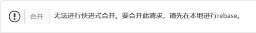

## 文档中心

  本文档中心为软件内部文档及说明,欢迎积极修改及添加

## 文档编辑流程

  - fork主仓
    fork主仓至自己的gitlab账号，仓库地址：

    [http://192.168.100.62/gitlab/doc/sw](http://192.168.100.62/gitlab/doc/sw)

  - 添加 SSH key: 

    1. generate SSH key:

    ```shell
    ssh-keygen -t rsa -C "<user name>@wuqi-tech.com"
    ```

    2. 将生成的 ~/.ssh/id_rsa.pub 文件内容拷贝至 gitlab 中； gitlab path: 设置 ==> Edit profile，在 User Settings 这一列中找到 SSH Keys，添加 id_rsa.pub 的内容即可。

  - clone账号中的项目至本地:

    ```git clone git@192.168.100.62:<user name>/sw.git```

  - 添加远端主仓以便于同步主仓中其他人的修改:

    ```git remote add upstream git@192.168.100.62:doc/sw.git```

  - 与主仓同步:

    ```shell
    git fetch upstream
    git merge upstream/master
    ```

  - 进行修改，并添加commit

  - 推送至自己账号中的仓库：

    ```git push origin master```

  - 新建合并请求
    在自己fork的项目中左侧栏选中**和并请求**点击右侧**新建合并请求**
    `Source branch` 选择自己项目中想要合并至主仓的分支，`Target branch` 选择 `doc/sw` 的 `master` 分支
    点击 `Compare branches and continue` 填写标题，描述，添加reviewer等，并点击`Submit 合并请求`

  - 进行rebase
    如果在merge之前有别的merge产生，则可能收到消息:

    !> 

    使用以下命令进行更新并再次推送：

    ```shell
    git fetch upstream
    git rebase upstream/master
    git push origin master
    ```

  - 等待管理员review并通过后，修改将被合并至主仓

## 编写及DEBUG

  ### 编写

  本文档完全基于markdown编写，基于[docsify](https://docsify.js.org/#/zh-cn/)完成静态网页生成
  推荐使用vscode进行编写，推荐安装以下插件:

  * Markdown All in One [[查看]](https://marketplace.visualstudio.com/items?itemName=yzhang.markdown-all-in-one) [[安装]](vscode:extension/yzhang.markdown-all-in-one)
  * SVG Viewer [[查看]](https://marketplace.visualstudio.com/items?itemName=cssho.vscode-svgviewer) [[安装]](vscode:extension/cssho.vscode-svgviewer)

  ### DEBUG

  - 安装python3
  - 在项目根目录下运行 ```python -m http.server 3000```
  - 在浏览器中打开[http://localhost:3000](http://localhost:3000)
