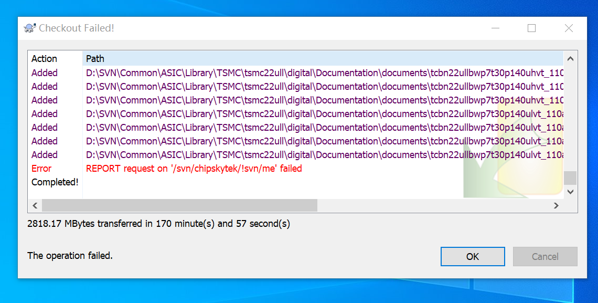

# SVN
1.	访问公司共享目录和执行SVN checkout（下载SVN数据）的时候，用无线网不成功。
解决方案：联系IT。IT说用网线联网就可以，用无线上网的话要先配置下。

2.	SVN下载未结束，中午出去吃饭回来不能再继续下载。执行SVN Update报错：locked。如图 SVN_Update报错所示。<a href="#figure1">图1</a>    或    [图1. Logo](#figure2) 

解决方案：
1. 找IT，执行了两次clean up：右击鼠标选择TortoiseSVN—Clean up。
2. 执行SVN Update。然后就可以继续下载了。

