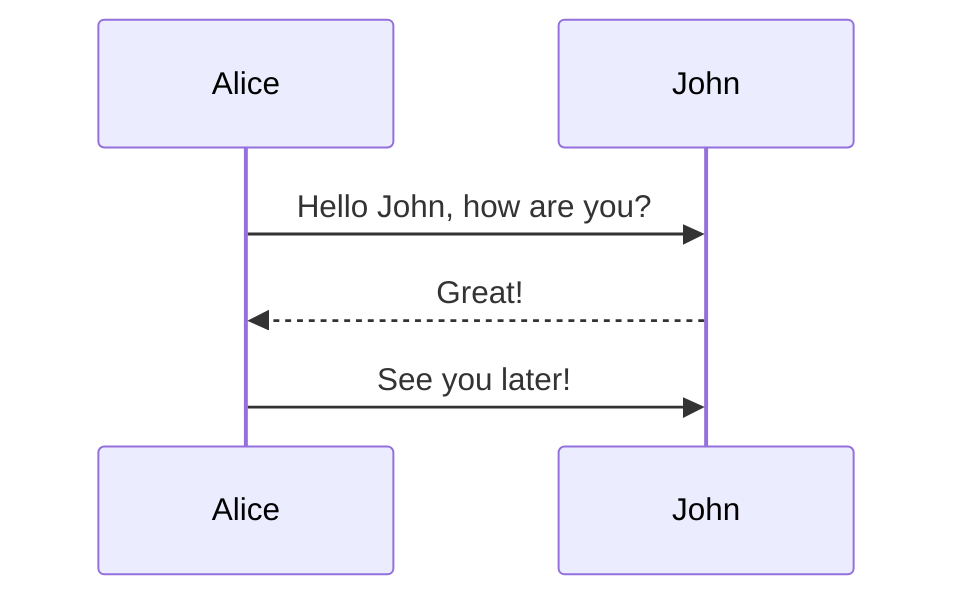

## Flow 标准流程图

使用下面的code，然后语法选择flow。

```st=>start: 开始
op=>operation: 处理框 
cond=>condition: 判断框
sub1=>subroutine: 子流程
io=>inputoutput: 输入输出框
e=>end: 结束框
st->op->cond
cond(yes)->io->e
cond(no)->sub1->op
```

```flow
st=>start: 开始
op=>operation: 处理框 
cond=>condition: 判断框
sub1=>subroutine: 子流程
io=>inputoutput: 输入输出框
e=>end: 结束框
st->op->cond
cond(yes)->io->e
cond(no)->sub1->op
```


## Sequence 时序图

只需要敲入以下代码，然后选择语言为`sequence`即可生成时序图。

```text
Title: 打招呼
李雷 -> 韩梅梅: Hello 梅梅, How are you?
Note left of 李雷: 李雷心想
Note right of 韩梅梅: 韩梅梅心想
韩梅梅 --> 李雷: I'm fine, thanks, and you?
Note over 李雷,韩梅梅: 我们是朋友
Participant 李华
Note right of 李华:没人陪我玩
```

```sequence
Title: 打招呼
李雷 -> 韩梅梅: Hello 梅梅, How are you?
Note left of 李雷: 李雷心想
Note right of 韩梅梅: 韩梅梅心想
韩梅梅 --> 李雷: I'm fine, thanks, and you?
Note over 李雷,韩梅梅: 我们是朋友
Participant 李华
Note right of 李华:没人陪我玩
```


敲入以下代码，语言选择mermaid

sequenceDiagram
    Alice->>John: Hello John, how are you?
    John-->>Alice: Great!
    Alice->>John: See you later!





