# Mermaid绘图

# 1 流程图 (Flow)

[mermaid 语法 - 云+社区 - 腾讯云 (tencent.com)](https://cloud.tencent.com/developer/article/1334691)
[Flowchart (mermaid-js.github.io)](https://mermaid-js.github.io/mermaid/#/flowchart)


Visio 2003将形状添加到绘图时自动给它们编号：

1. 视图—加载项—其他Visio方案——给形状编号。
2. 单击“常规”选项卡，在“操作”下，单击“自动编号”。
3. 在“分配的编号”下，指定所需的形状编号选项。
4. 选取“将形状放到页上时继续给形状编号”复选框。
5. 要指定形状编号是出现在形状文本之前还是之后，请单击“高级”选项卡。在“编号的位置”下，单击所需的位置。
6. 注释 要停止将形状拖到绘图页时给形状编号，请右击绘图页，然后单击“放下时给形状编号”来去除复选标记。
7. 提示：要手动给某个形状编号，请单击“常规”选项卡。在“操作”下单击“单击以手动编号”，再单击“确定”。然后，在“手动编号”对话框打开的情况下单击相应的形状。


标准流程图

```flow
st=>start: 开始框
op=>operation: 处理框
cond=>condition: 判断框(是或否?)
sub1=>subroutine: 子流程
io=>inputoutput: 输入输出框
e=>end: 结束框
st->op->cond
cond(yes)->io->e
cond(no)->sub1(right)->op
```


标准流程图（横向）


```flow
st=>start: 开始框
op=>operation: 处理框
cond=>condition: 判断框(是或否?)
sub1=>subroutine: 子流程
io=>inputoutput: 输入输出框
e=>end: 结束框
st(right)->op(right)->cond
cond(yes)->io(bottom)->e
cond(no)->sub1(right)->op
```


# 2 流程图（Mermaid-graph）

graph:

Possible FlowChart orientations are:

- TB - top to bottom
- TD - top-down/ same as top to bottom
- BT - bottom to top
- RL - right to left
- LR - left to right

Links between nodes: 

* A link with arrow head: A-->B
* An open link: A --- B
* A---|This is the text|B
* A-->|text|B
* Dotted link: A-.->B
* Dotted link with text: A-. text .-> B


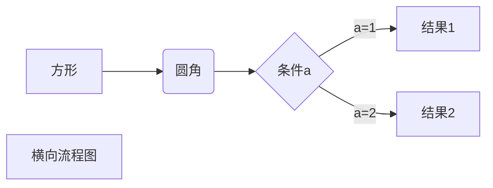


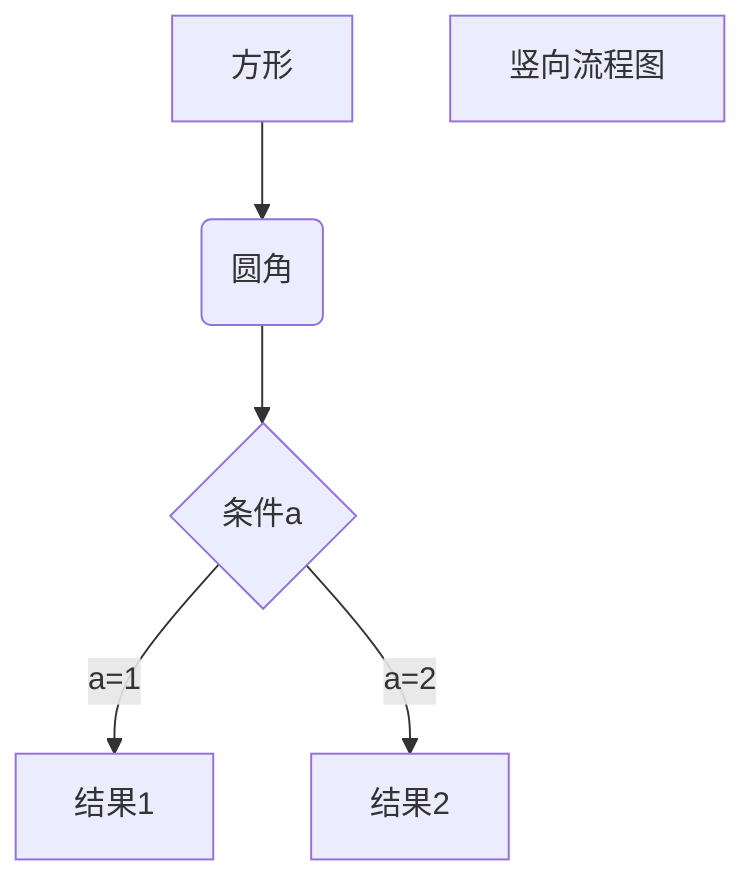

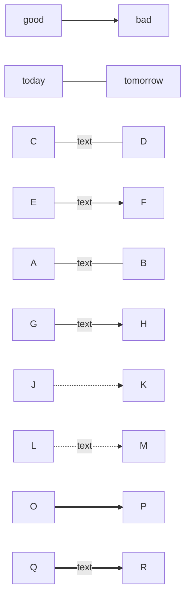


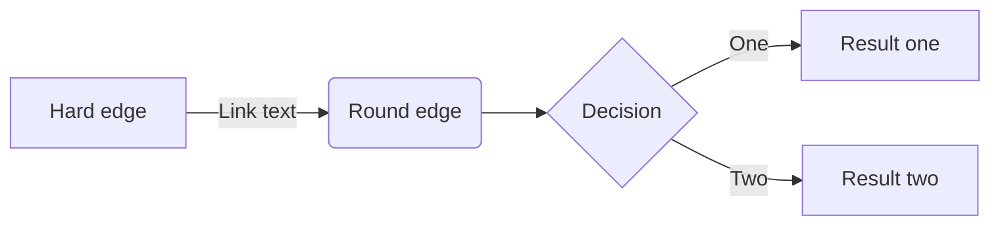

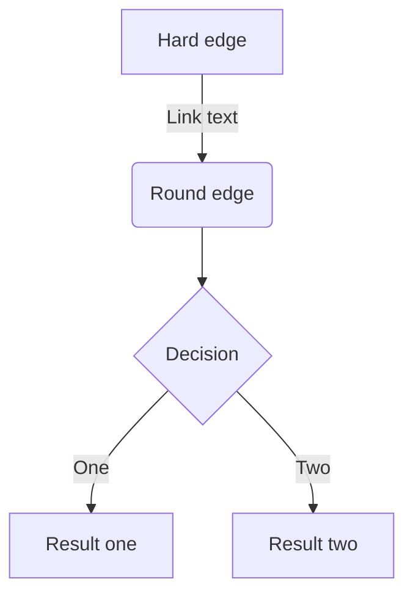


flowchart:


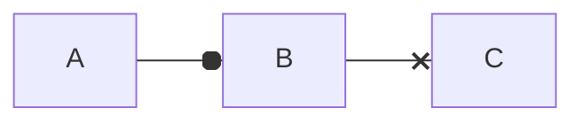

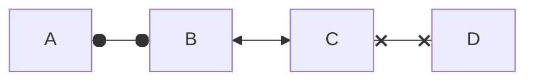

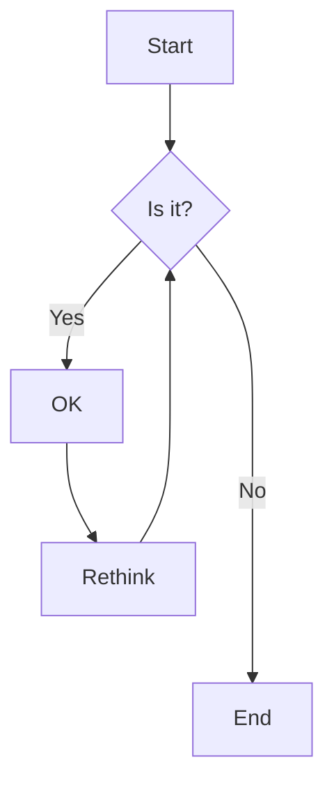


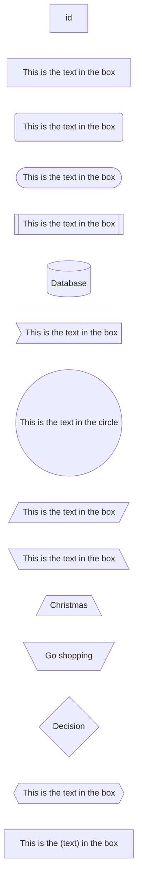


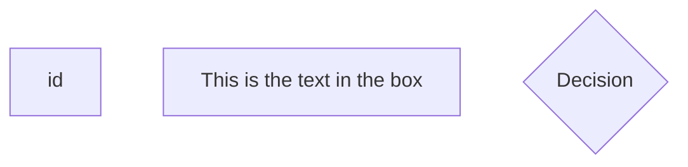


# 3 时序图 Sequence Diagram

->>带箭头

->直线

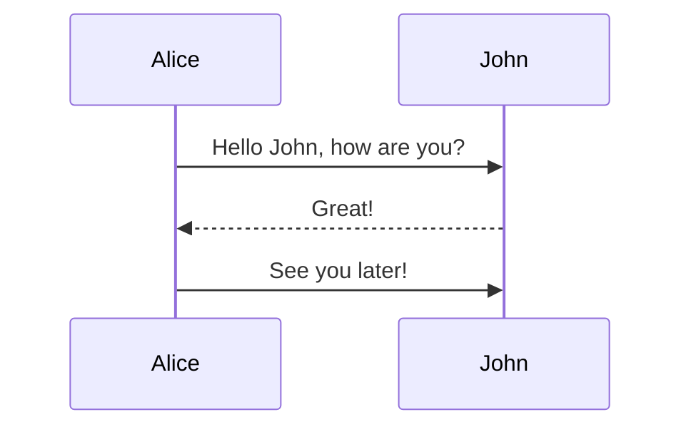


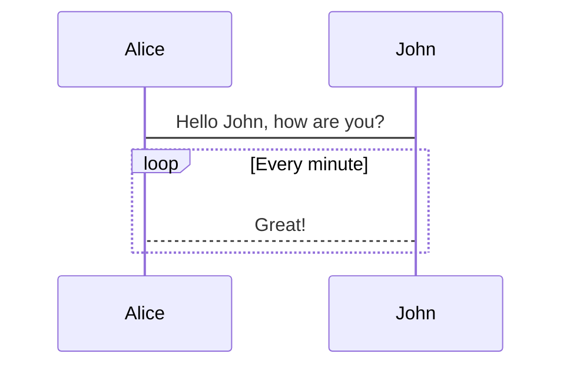


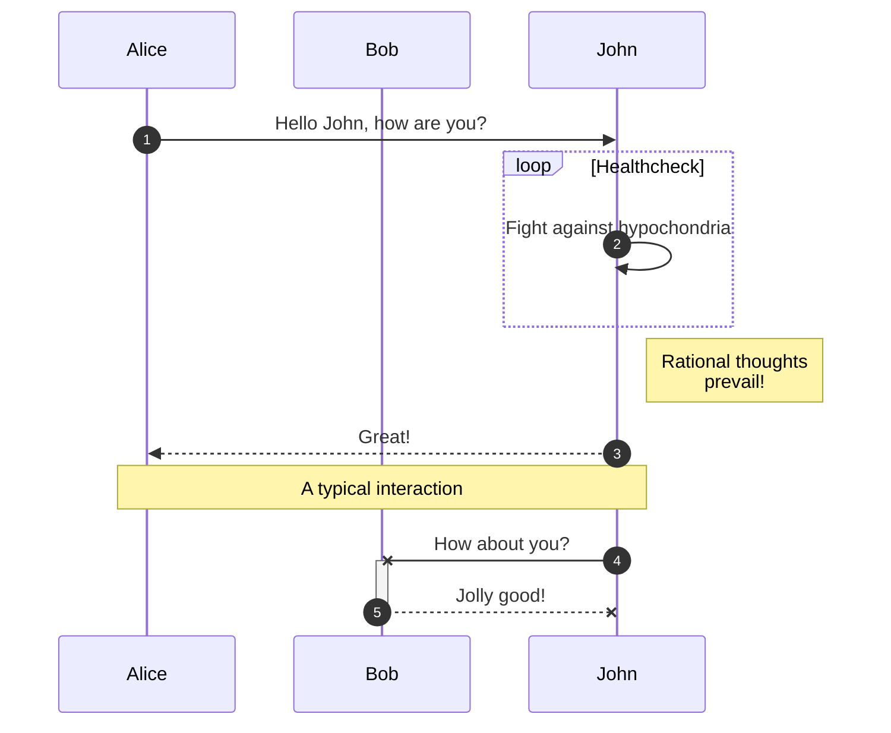

There are six types of arrows currently supported:

| Type | Description                                      |
| ---- | ------------------------------------------------ |
| ->   | Solid line without arrow                         |
| -->  | Dotted line without arrow                        |
| ->>  | Solid line with arrowhead                        |
| -->> | Dotted line with arrowhead                       |
| -x   | Solid line with a cross at the end               |
| --x  | Dotted line with a cross at the end.             |
| -)   | Solid line with an open arrow at the end (async) |
| --)  | Dotted line with a open arrow at the end (async) |


# 3 状态图 State Diagram

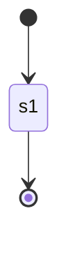


# 4 类图 Class Diagram

<|--表示继承

+表示public

-表示private

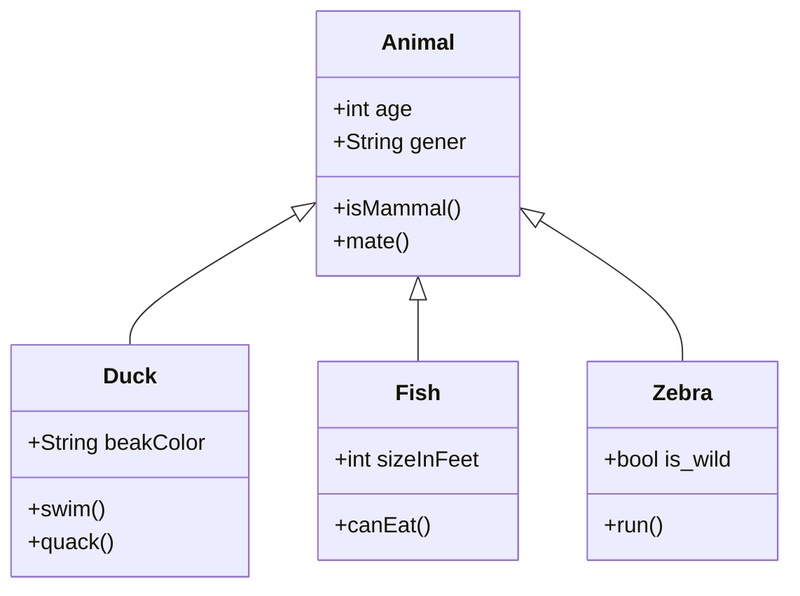


# 4 甘特图


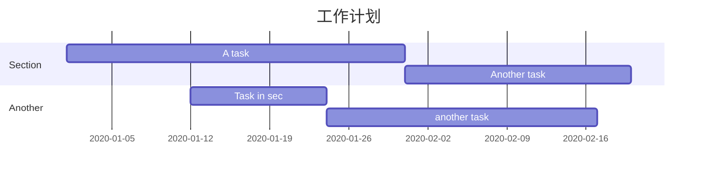


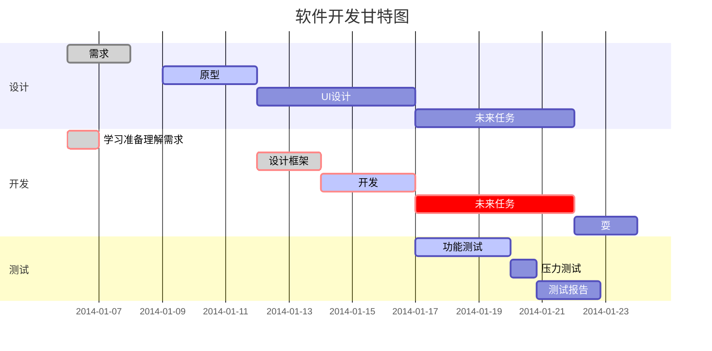

# 5 饼图 Pie


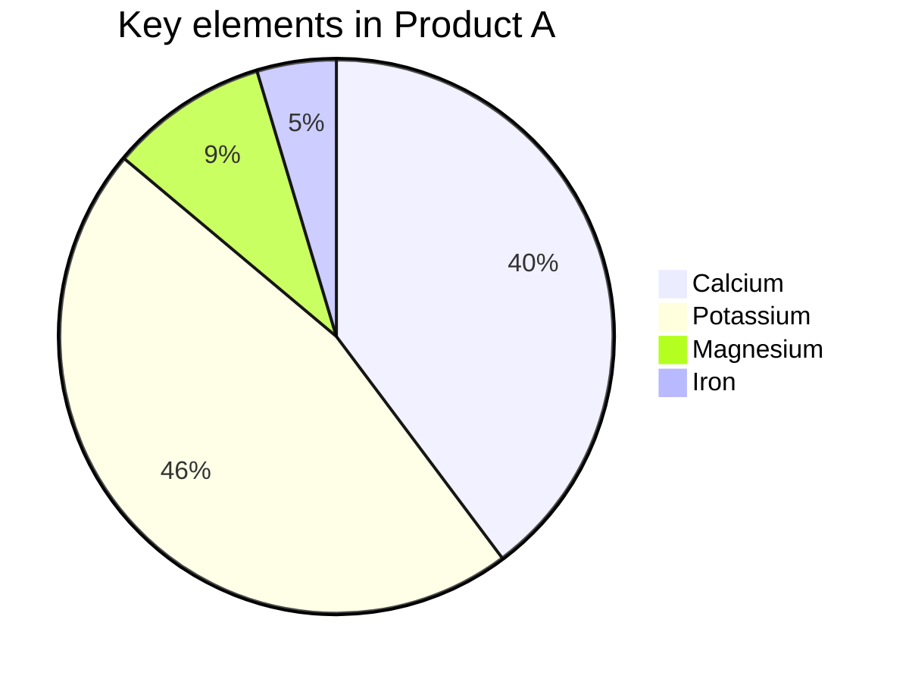

