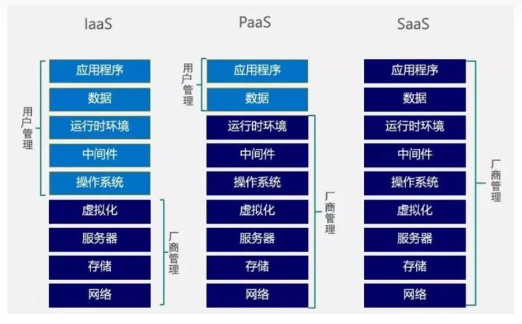

# 人工智能、高性能计算、云计算

## 人工智能和深度学习
* 人工智能：让计算机像人类一样思考和行动。
* 机器学习：实现人工智能的方法。
* 深度学习：一种实现机器学习的技术。
深度学习是人工智能领域机器学习方向的一个分支。因为近几年来深度学习的爆发式发展，一些不严谨的说法将AI等同于深度学习。

## 机器学习

英文：machine learning

定义：计算机通过**对数据、事实或自身经验的自动分析和综合获取知识**的过程。
见载：计算机科学技术名词
学科：计算机科学技术_人工智能_机器学习

## 深度学习（训练+推理）

英语名：	deep learning

定义：	欣顿（Hinton）等提出的一种**研究信息的最佳表示及其获取方法的技术**，在神经网络或信念网络的情况下是**对基于深层结构或网络表示的输入输出间映射进行机器学习的过程**。

见载：	计算机科学技术名词

学科：	计算机科学技术_人工智能_神经网络

公布年度：	2018

在深度学习里，**Tensor实际上就是一个多维数组（multidimensional array）**。而Tensor的目的是能够**创造更高维度的矩阵、向量**。

**Tensorflow里最基本的数据结构就是Tensor**。张量是**多维数组**的泛概念。

张量概念包括**标量、向量和线性算子**。   https://zhuanlan.zhihu.com/p/48982978

### 宏观框架

**深度学习**的宏观框架——训练（training）和推理（inference）及其应用场景：

一个**完整的深度框架**中应该包含两个主要部分：

* 训练（training）
* 推理（inference）

### 训练（Training）

打个比方，你现在想要**训练一个能区分苹果还是橘子的模型**，你需要搜索一些苹果和橘子的图片，这些图片放在一起称为**训练数据集（training dataset）**，训练数据集是有标签的，苹果图片的标签就是苹果，橘子亦然。

一个初始**神经网络**通过不断的**优化自身参数**，来让自己变得准确，可能开始10张苹果的照片，只有5张被网络认为是苹果，另外5张认错了，这个时候通过优化参数，让另外5张错的也变成对的。这整个过程就称之为训练（Traning）。

### 推理（Inference）

你训练好了一个模型，在训练数据集中表现良好，但是我们的期望是它可以对以前没看过的图片进行识别。你重新拍一张图片扔进网络让网络做判断，这种图片就叫做**现场数据（live data）**，如果现场数据的区分准确率非常高，那么证明你的网络训练的是非常好的。我们把训练好的模型拿出来遛一遛的过程，称为推理（Inference）。

### 部署（deployment）

想要把一个训练好的**神经网络模型**应用起来，需要把它放在某个硬件平台上并保证其能运行，这个过程称之为部署（deployment）。

应用场景

从研发角度来说，对于一个专门研究算法的人，他的目的是通过训练得到一个效果非常好的模型，所以他的应用场景会在一个高性能的运算平台上，通俗的来说，就是不计成本的使用算力比较牛B的计算机，比如NVIDIA的服务器集群。

从产品应用角度来说，不管你的AI算法是部署在智能手机还是其他的一些特定的应用场景，比如安防用的摄像头，野外工作的机器人，医院的智能诊断读片机，给每个应用都分配一个高速计算平台显然是不合理也是不可能的，因此目前很多的终端在使用AI的时候都是数据上传到云上，通过高性能服务器获取结果再传给终端，比如支付宝的AI扫福，断网可能就玩不了了，这个还好，有一些场景是很容易或者需要断网的，比如恶劣天气，保密机构，那么在终端上独立完成AI运算就显得很重要。

## 机器视觉（人工智能的一个分支）

**用机器代替人眼来做测量和判断。**

见载：	海峡两岸信息科学技术名词
学科：	信息科学技术
公布年度：	2008

利用摄像装置摄取物体的像，并由计算机或其他智能设备实现对图像的校正、处理、识别、理解和特征提取，进而根据判别的结果来控制现场设备动作的过程。

**机器视觉是人工智能正在快速发展的一个分支**。简单说来，机器视觉就是**用机器代替人眼来做测量和判断**。

机器视觉系统是通过机器视觉产品(即**图像摄取装置**，分CMOS和CCD两种)将被摄取目标转换成图像信号，传送给专用的图像处理系统，得到被摄目标的形态信息，根据像素分布和亮度、颜色等信息，转变成数字化信号;图像系统对这些信号进行各种运算来抽取目标的特征，进而根据判别的结果来控制现场的设备动作。 

机器视觉系统最基本的特点就是**提高生产的灵活性和自动化程度**。

- 在一些不适于人工作业的危险工作环境或者人工视觉难以满足要求的场合，常用机器视觉来替代人工视觉。
- 同时，在大批量重复性工业生产过程中，用机器视觉检测方法可以大大提高生产的效率和自动化程度。 

## 高性能计算 (HPC) /超级计算

高性能计算 (HPC) 或超级计算和日常计算一样，区别只在于它的**计算能力更强大**。它能够通过聚合结构，使用多台计算机和存储设备，以极高速度处理大量数据，帮助人们探索科学、工程及商业领域中的一些世界级的重大难题。

HPC使用**超级计算机和并行处理技术**解决复杂计算问题。HPC技术专注于发展并行处理算法和并行处理系统。

HPC典型地通过计算机建模、模拟和分析，用于解决高级问题并进行研究活动。**HPC系统有能力通过并行使用计算资源提供持续性能。**

HPC (High Performance Computing)与**超算（supercomputing）**有时是同义词。

HPC是为了满足对处理速度的持续增长的速度而发展起来的。HPC整合多种技术（如计算机结构、算法、程序、电子和系统软件），高效和快速的解决高级问题。HPC要求**高带宽、低延迟的网络**来连接多个节点和集群。

高性能计算的特点：

- 快速计算：在短时间内完成大量计算任务
- 用户友好：用户快速构建和修改计算流程
- 可扩展性：根据用户计算量申请计算资源，没有硬件限制
- 与云计算的关系：**HPC集群通常在云上构建**

高性能计算的应用：

HPC技术在多种学科领域有广泛应用：

- 生命科学
- 地球科学
- 地图学和地理学
- 油气工业建模
- 气候建模
- 电子设计自动化
- 媒体和娱乐

高性能计算的技术栈：

操作系统
IO低延迟高带宽
存储
集群管理
分布式任务调度
运维
实时扩容
通信框架：MPI
算法平台
高性能计算产业发展的动力
算法
算力（核心）
数据

## 云计算（cloud computing）

资料（梳理清楚最关键的名词概念，对云计算有一个框架性的认知）：[科普 | 什么是云计算 - 知乎 (zhihu.com)](https://zhuanlan.zhihu.com/p/69774299)

云计算是一种**基于互联网的计算方式**，通过这种方式，**共享的软硬件资源和信息**可以**按需提供给计算机和其他设备**。

**提供资源的网络**被称为“云”。

云计算领域的三位大佬：laaS、PaaS、和SaaS。

- IaaS：基础设施服务，Infrastructure-as-a-service
- PaaS：平台服务，Platform-as-a-service
- SaaS：软件服务，Software-as-a-service

服务层次的区别：

- IaaS，提供**最底层服务**。**最接近服务器硬件资源**，这样用户可以**以最大的自由度接入网络本身**。
- PaaS，提供**更高一层服务**。整体服务**向用户隐藏了底层的网络、存储、操作系统等等技术问题**，也就是说底层服务对用户是透明的，而**向用户开放的是软件本身的开发和运行环境**。
- SaaS，提供**最上层服务**。大部分用户会**用简单客户端的方式调用该层级的服务**。用户可以根据自己的需求，通过网络向供应商订制商业模型，一些比较简单的例子是Google的文档，表格等等。

云计算

如果要对物理资源进行管理，第一步，就是**“虚拟化”**。

**虚拟化是云计算的基础**。简单来说，虚拟化就是**在一台物理服务器上，运行多台“虚拟服务器”**。这种虚拟服务器，也叫**虚拟机（VM，Virtual Machine）**。

从表面来看，这些虚拟机都是独立的服务器，但实际上，它们共享物理服务器的CPU、内存、硬件、网卡等资源。

物理机，通常称为“**宿主机（Host）**”。虚拟机，则称为“**客户机（Guest）**”。

谁来完成物理资源虚拟化的工作呢？

就是大名鼎鼎的 **Hypervisor** 。

Hypervisor，汉译过来是“超级监督者”，也叫做VMM（Virtual Machine Monitor，虚拟机监视器）。它不是一款具体的软件，而是**一类软件的统称**。

Hypervisor分为两大类：

- 第一类，hypervisor直接运行在物理机之上。虚拟机运行在hypervisor之上。
- 第二类，物理机上安装正常的操作系统（例如Linux或Windows），然后在正常操作系统上安装hypervisor，生成和管理虚拟机。

像**VMware**、**KVM**、**Xen**、**Virtual Box**，都属于Hypervisor。

VMware大家应该很熟悉，就是VMware Workstation。**学习Linux的话，很多人都是在windows系统下安装WMware，然后创建Linux虚拟机**。

但是，真正厉害的，是 **KVM（kernel-based virtual machine，基于Linux内核的虚拟机）**。它是目前最热门最受追捧的虚拟化方案。

KVM这样的Hypervisor软件，实际上是提供了一种虚拟化能力，模拟CPU的运行，更为底层。但是它的用户交互并不良好，不方便使用。

于是，为了更好地管理虚拟机，就需要**OpenStack**这样的**云管理平台**。

关于OpenStack，我之前曾经介绍过（[链接](https://link.zhihu.com/?target=http%3A//mp.weixin.qq.com/s%3F__biz%3DMzI1NTA0MDUyMA%3D%3D%26mid%3D2456660029%26idx%3D1%26sn%3D1a900a0c45ff77355693e7902c3d8f38%26chksm%3Dfda5055acad28c4c34d015b72843ef14c5529f81651cf38daddd1ce4d7e595c9f937f1ee3327%26scene%3D21%23wechat_redirect)）。它有点像个商店，负责管理商品（计算资源、存储资源、网络资源等），卖给用户，但它本身不制造商品（**不具备虚拟化能力**），它的商品，来自于KVM。当然，如果不用KVM，也可以用Xen等其它hypervisor。

上面所说的几个概念，包括VM、KVM、OpenStack等，都主要属于IaaS（基础设施即服务）。

**容器 VS 虚拟机**

那么，容器、Docker、K8S，又是什么呢？

根据前文所说的虚拟化方式，人们在使用一段时间后发现，它存在一些问题：

不同的用户，有时候只是希望运行各自的一些简单程序，跑一个小进程。为了不相互影响，就要建立虚拟机。如果建虚拟机，显然浪费就会有点大，而且操作也比较复杂，花费时间也会比较长。

而且，有的时候，想要迁移自己的服务程序，就要迁移整个虚拟机。显然，迁移过程也会很复杂。

有没有办法更灵活快速一些呢？

有，这就引入了**“容器（Container）”**。

容器也是虚拟化，但是属于**“轻量级”的虚拟化**。它的目的和虚拟机一样，都是为了**创造“隔离环境”**。但是，它又和虚拟机有很大的不同——**虚拟机是操作系统级别的资源隔离，而容器本质上是进程级的资源隔离**。

而大家常听说的**Docker**，就是**创建容器的工具，是应用容器引擎**。

Docker的中文意思，就是码头工人。而它的LOGO，就是一只鲸鱼背着很多货柜箱。

相比于传统的虚拟机，Docker的优势很明显，它启动时间很快，是秒级，而且对资源的利用率很高（一台主机可以同时运行几千个Docker容器）。此外，它占的空间很小，虚拟机一般要几GB到几十GB，而容器只需要MB级甚至KB级。

除了Docker对容器进行创建之外，我们还需要一个工具，**对容器进行编排**。

这个工具，就是**K8S**。

**K8S**，就是**Kubernetes**，中文意思是舵手或导航员。Kubernetes这个单词很长，所以大家把中间8个字母缩写成8，就成了K8S。

K8S是一个容器集群管理系统，主要职责是**容器编排（Container Orchestration）**——启动容器，自动化部署、扩展和管理容器应用，还有回收容器。

简单来说，K8S有点像容器的保姆。它负责管理容器在哪个机器上运行，监控容器是否存在问题，控制容器和外界的通信，等等。

通过下面这张K8S系统结构图，就能够看出K8S和容器之间的关系。

除了K8S之外，还有很多种容器管理平台，例如**Compose**，**Marathon**，**Swarm**，**Mesos**等。

**Docker和K8S，关注的不再是基础设施和物理资源，而是应用层，所以，就属于PaaS。**

不管怎么说，梳理清楚最关键的名词概念，对云计算有一个框架性的认知，是学好云计算的第一步。

## 云游戏

云游戏是以云计算为基础的游戏方式，在云游戏的运行模式下，**所有游戏都在服务器端运行，**并将渲染完毕后的游戏画面压缩后通过网络传送给用户。**在客户端，用户的游戏设备不需要任何高端处理器和显卡**，只需要基本的视频解压能力就可以了。

## 边缘计算

边缘计算（edge computing），是指在**靠近物或数据源头的一侧，采用网络、计算、存储、应用核心能力为一体的开放平台，就近提供最近端服务**。

其**应用程序在边缘侧发起，产生更快的网络服务响应**，满足行业在实时业务、应用智能、安全与隐私保护等方面的基本需求。边缘计算处于物理实体和工业连接之间，或处于物理实体的顶端。而云端计算，仍然可以访问边缘计算的历史数据。

## 云主机 cloud hosting

#### 云主机的服务模式：

云主机服务以三种模式提供服务：基础设施即服务（IaaS），平台即服务（PaaS）和软件即服务（SaaS）。

- IaaS：通过安装在数据中心的大量设备，提供虚拟计算机磁盘映像库，原始区块储存，文件存储器或对象存储器，防火墙，负载平衡器，IP地址，VLAN及所需软件包。用户可通过网络获取这些资源。**IaaS包含公用云、私有云和混合云三种部署方式。**
- PaaS：是一个为程序员**开发、测试、运行及管理应用**所设的平台，**为应用开发提供良好环境**。
- SaaS：为消费者使用应用程序，软件服务提供商掌控应用并通过网络将其提供给用户。在SaaS模式之下，云服务提供商在云端安装运行应用软件，**用户通过云客户端访问软件**，并不掌控云基础设施和应用运行平台。

#### 云计算的部署模型及其特点：

**云计算**有三种**部署模型**：私有云，公共云和混合云。

- 私有云：由单个组织或第三方独立运行。与公有云相比，私有云拥有独立资源池，安全性更高，掌控性更强。
- 公有云：通过网络开放给公众使用。与私有云相比，公有云在技术配备上几乎一致，但存在安全问题。
- 混合云：结合公有云及私有云，提供多种开发模式。混合云灵活高效，且价格实惠。

## 公有云

公有云通常指**第三方提供商为用户提供的能够使用的云**，公有云一般可通过 Internet 使用，可能是免费或成本低廉的，公有云的核心属性是**共享资源服务**。这种云有许多实例，可在当今整个开放的公有网络中提供服务。

## 硬件编码

- 软件编码：所有的编码逻辑都是在CPU/GPU上执行，会大量消耗CPU/GPU资源。
- **硬件编码**：**有专门的硬件来编码**，编码逻辑被**固化**在**专用的编码芯片**里面了，不会再大量消耗CPU/GPU算力资源。

说明：CPU/GPU是通用算力资源，简言之就是几乎所有的事情都可以干，也就是很多需求都会竞争通用算力资源了。

## 音频视频编码

视频编码：指通过特定的压缩技术，将某个视频格式的文件**转换成另一种视频格式文件**的方式。

常见的音频视频编码：

- MPEG系列
- H.26X系列

**H.264，同时也是MPEG-4第十部分**，是由视频编解码技术的组织国际电联（ITU-T）视频编码专家组（VCEG）和ISO/IEC动态图像专家组（MPEG）联合组成的联合视频组（JVT）提出的高度压缩数字视频编解码器标准。这个标准通常被称之为**H.264/AVC**--用来明确的说明它两方面的开发者。

因此，**不论是MPEG-4 AVC、MPEG-4 Part 10，还是ISO/IEC 14496-10，都是指H.264**。

而**H.265（HEVC，High Efficiency Video Coding，高效率视频编码）**，是**新一代视频编码技术**。它围绕现有视频编码标准H.264，保留原来的某些技术，使用新技术对某些方面进行改进优化，如码流、编码质量、延时等，提高压缩效率、增强鲁棒性和错误恢复能力、减少实时的时延、降低复杂度等。

**HDE (High Density Encoding, 高密度编码) 是**由Codex开发的一种针对拜尔样式图像进行了优化的编码技术。通常情况下，使用HDE编码的ARRIRAW影像约为其原始大小的60%. H**DE编码是完全无损的**，对其解码时，可获得与原始文件每一bit的精确匹配。

## 图像转码（image transcoding）

Anything related to image transcoding, i.e. the process of **converting a digital image from a storage format to another** (e.g. from PNG to JPG).

## 超分（超分辨率）

超分辨率(（SR）Super-Resolution)通过硬件或软件方法提高原有图像的分辨率，通过一幅或者多幅低分辨率的图像来得到一幅高分辨率的图像过程就是超分辨率重建，可以通过人工智能深度学习将低分辨率视频重建成高分辨率视频，模糊图像、视频瞬间变高清，为移动端为用户带来极致视频体验。

广义的超分辨率 (SR, Super Resolution) 是指一类用于提升图像分辨率的技术。这类技术已经存在了很长一段时间，应用也非常广泛。事实上，每当我们需要以不同于原始分辨率的尺寸来显示或存储图像时，就已经使用了SR，只不过使用的是其中最为简单的那类算法而已。

随着图像处理理论的发展，以及机器学习的普及和更高性能的处理器的出现，各类更优秀的SR算法陆续出现。现在我们提及SR时，往往是特指依靠机器学习来实现的图像放大算法。下文提到SR时也均特指这类算法。它能够提供远超于传统图像放大算法的图像质量。当然，运算量也要高得多。
