# 1 流程图 (Flow)

标准流程图

```flow
st=>start: 开始框
op=>operation: 处理框
cond=>condition: 判断框(是或否?)
sub1=>subroutine: 子流程
io=>inputoutput: 输入输出框
e=>end: 结束框
st->op->cond
cond(yes)->io->e
cond(no)->sub1(right)->op
```


标准流程图（横向）


```flow
st=>start: 开始框
op=>operation: 处理框
cond=>condition: 判断框(是或否?)
sub1=>subroutine: 子流程
io=>inputoutput: 输入输出框
e=>end: 结束框
st(right)->op(right)->cond
cond(yes)->io(bottom)->e
cond(no)->sub1(right)->op
```


# 2 流程图（Mermaid-graph）

graph:

Possible FlowChart orientations are:

- TB - top to bottom
- TD - top-down/ same as top to bottom
- BT - bottom to top
- RL - right to left
- LR - left to right

Links between nodes: 

* A link with arrow head: A-->B
* An open link: A --- B
* A---|This is the text|B
* A-->|text|B
* Dotted link: A-.->B
* Dotted link with text: A-. text .-> B


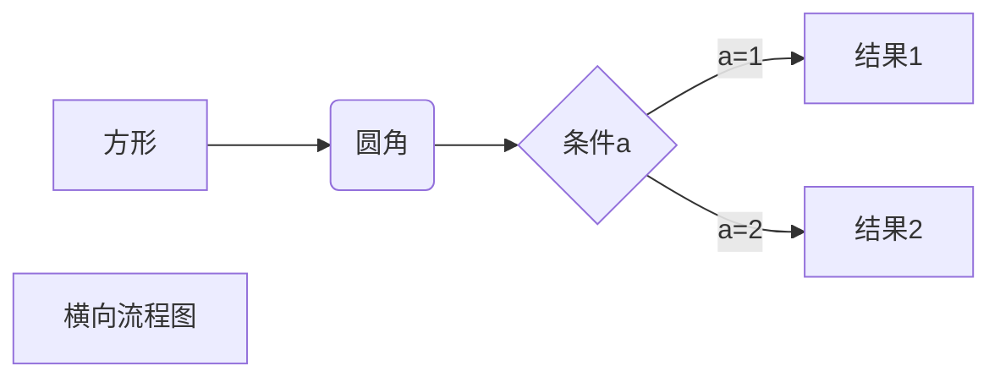


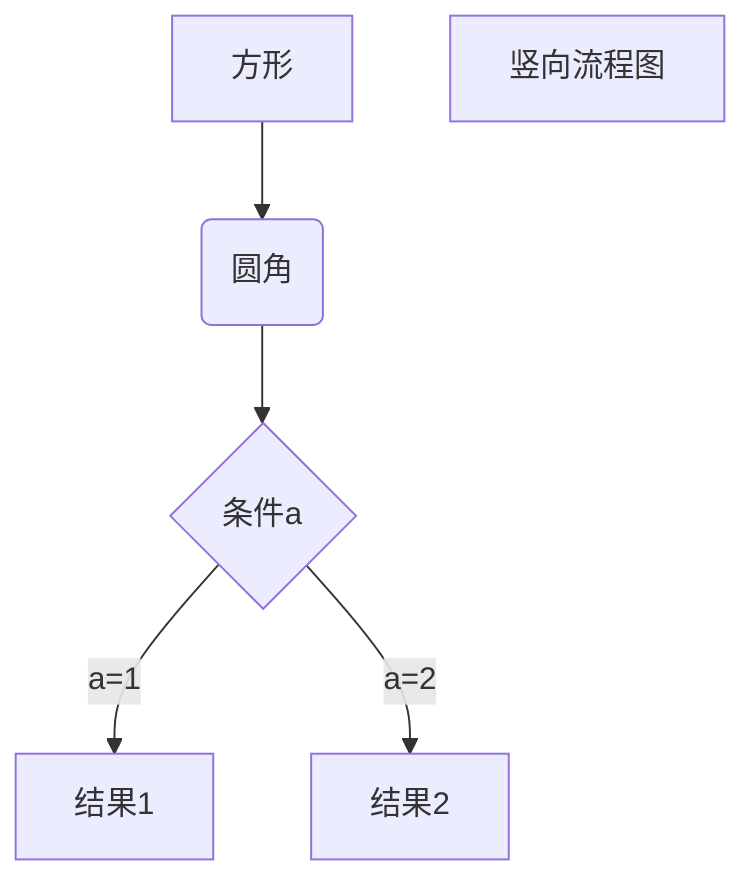

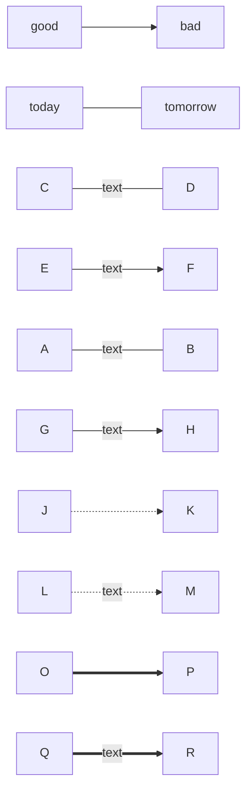


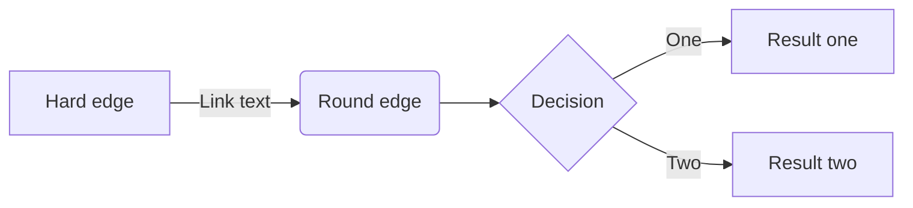

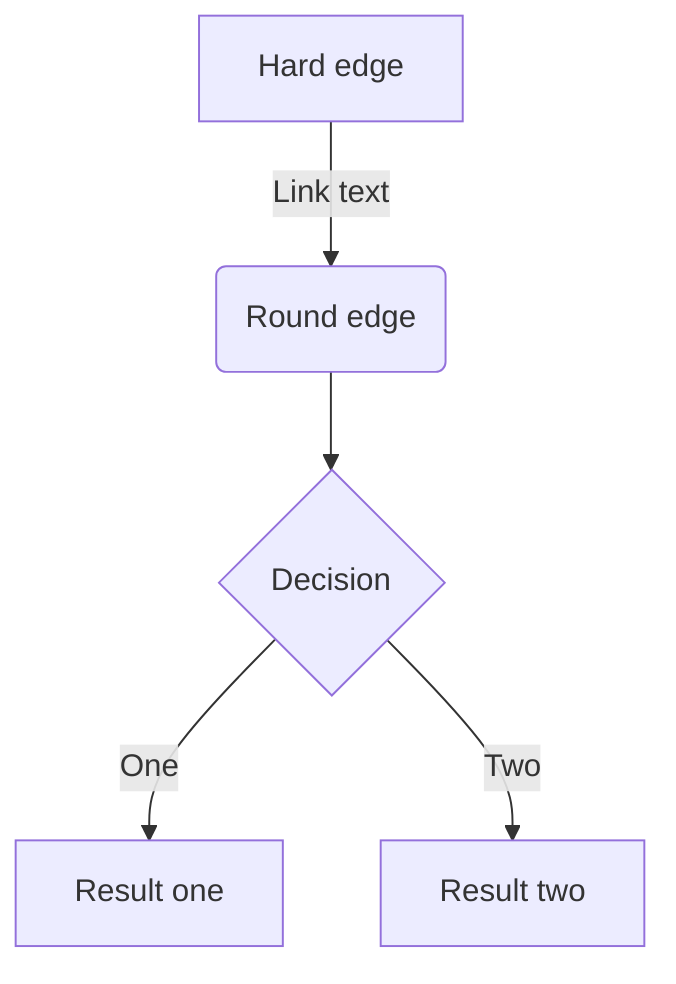


flowchart:


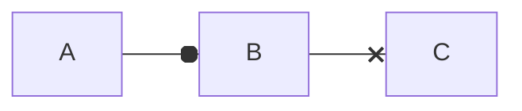

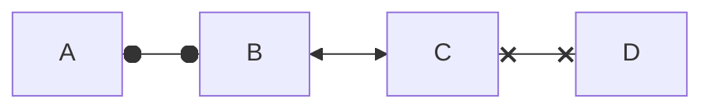

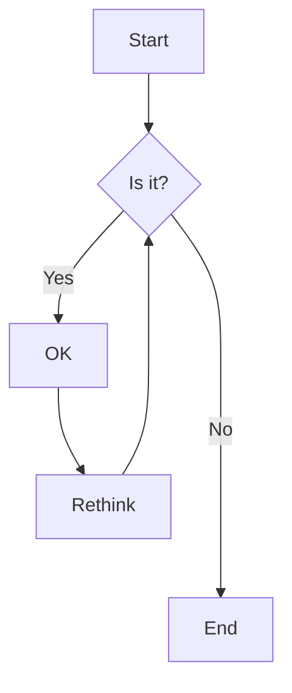


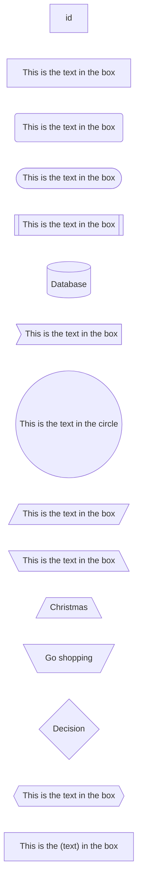


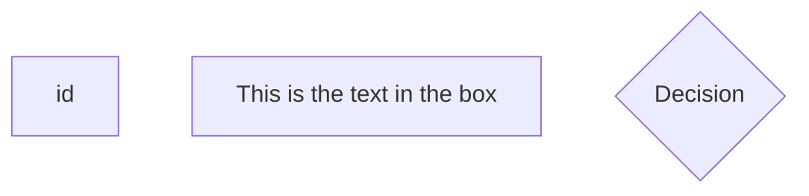


# 3 时序图 Sequence Diagram

->>带箭头

->直线

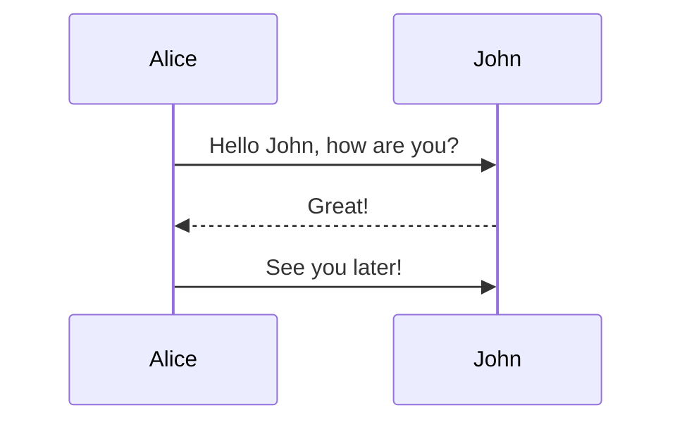


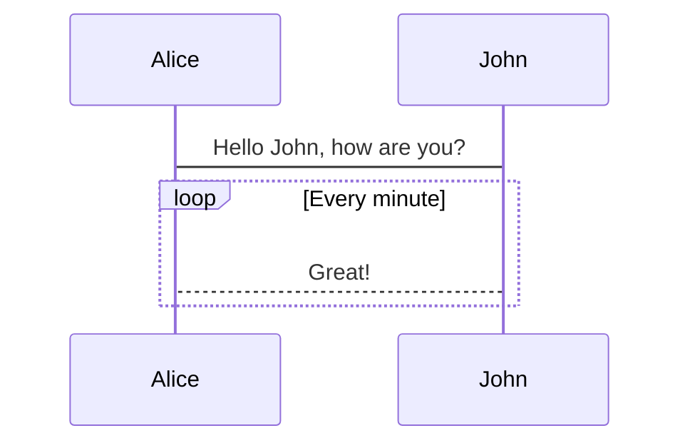


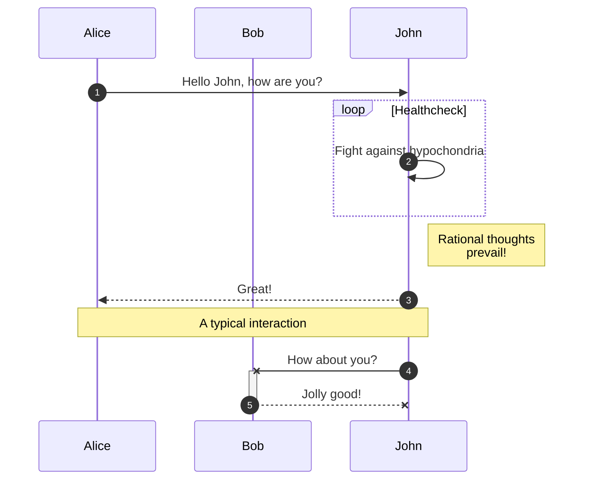

There are six types of arrows currently supported:

| Type | Description                                      |
| ---- | ------------------------------------------------ |
| ->   | Solid line without arrow                         |
| -->  | Dotted line without arrow                        |
| ->>  | Solid line with arrowhead                        |
| -->> | Dotted line with arrowhead                       |
| -x   | Solid line with a cross at the end               |
| --x  | Dotted line with a cross at the end.             |
| -)   | Solid line with an open arrow at the end (async) |
| --)  | Dotted line with a open arrow at the end (async) |


# 3 状态图 State Diagram

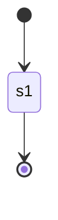


# 4 类图 Class Diagram

<|--表示继承

+表示public

-表示private

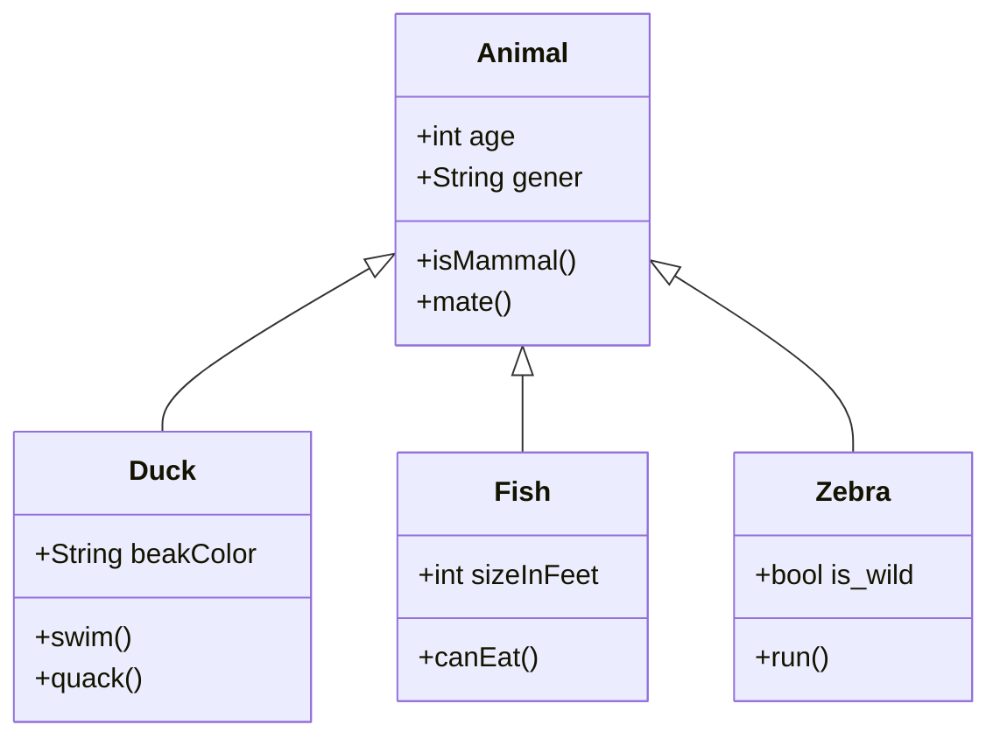


# 4 甘特图


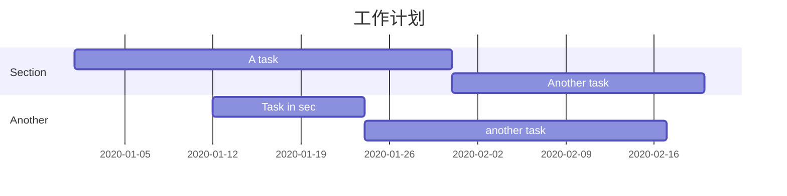


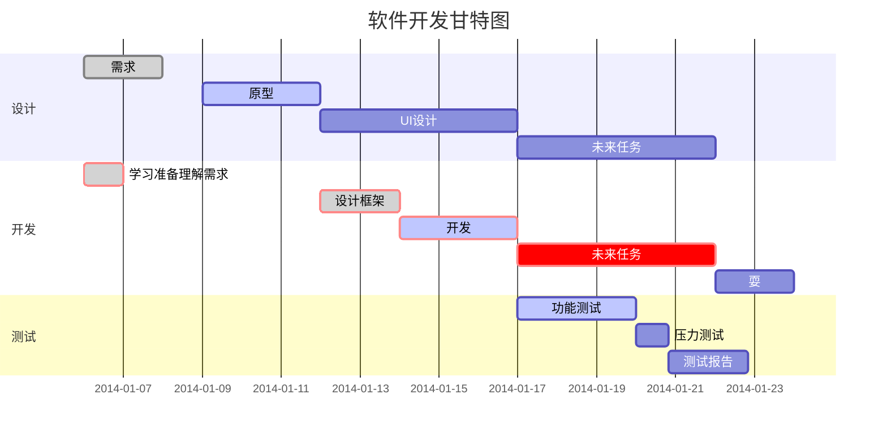

# 5 饼图 Pie


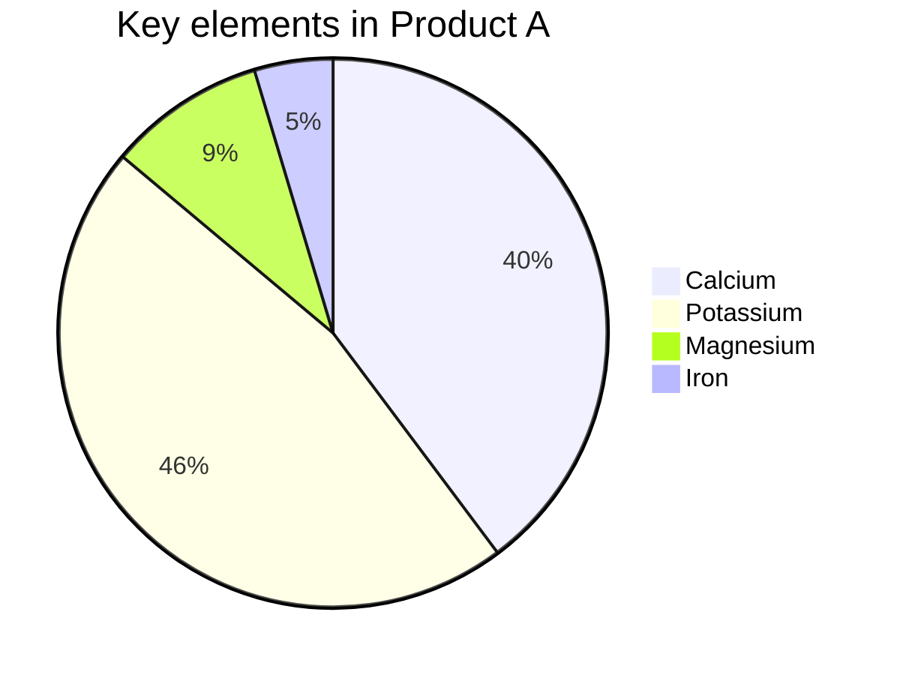

