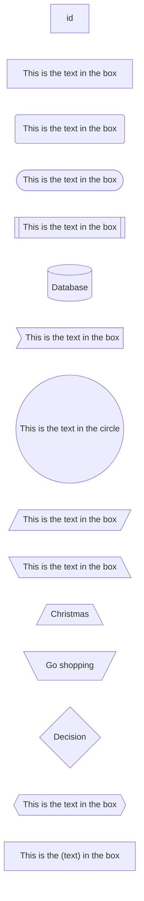

[toc]


# 1 LaTex

[使用LaTeX基本数学公式_nankeyimeng的博客-CSDN博客](https://blog.csdn.net/qq_32126633/article/details/78725235)

正文中的公式用 `$...$` 来定义，单独显示的用 `$$...$$` 来定义

1. 行内公式       $f(x) = \sum*_{i=0}^{N}\int_*{a}^{b} g(t,i) \text{ d}t$

2. 行间公式

$$
f(x) = \sum*_{i=0}^{N}\int_*{a}^{b} g(t,i) \text{ d}t
$$


$$
\varGamma(x) = \frac{\int_{\alpha}^{\beta} g(t)(x-t)^2\text{ d}t }{\phi(x)\sum_{i=0}^{N-1} \omega_i} \tag{2}
$$


## 1.1 基本LaTeX公式命令

希腊字母

> | 命令       | 显示 |      | 命令     | 显示 |
> | :--------- | :--- | :--- | :------- | :--- |
> | `\alpha`   | α    |      | `\beta`  | β    |
> | `\gamma`   | γ    |      | `\delta` | δ    |
> | `\epsilon` | ϵ    |      | `\zeta`  | ζ    |
> | `\eta`     | η    |      | `\theta` | θ    |
> | `\iota`    | ι    |      | `\kappa` | κ    |
> | `\lambda`  | λ    |      | `\mu`    | μ    |
> | `\xi`      | ξ    |      | `\nu`    | ν    |
> | `\pi`      | π    |      | `\rho`   | ρ    |
> | `\sigma`   | σ    |      | `\tau`   | τ    |
> | `\upsilon` | υ    |      | `\phi`   | ϕ    |
> | `\chi`     | χ    |      | `\psi`   | ψ    |
> | `\omega`   | ω    |      |          |      |

如果使用大写的希腊字母，把命令的首字母变成大写即可，例如 `\Gamma` 输出的是 Γ。

如果使用斜体大写希腊字母，再在大写希腊字母的*LaTeX*命令前加上var，例如`\varGamma` 生成 Γ。


## 1.2 和号和积分号

和号和积分号比较常用，这里也列出来：

> | 命令                | 显示  |      | 命令                | 显示  |
> | :------------------ | :---- | :--- | :------------------ | :---- |
> | `\sum`              | ∑     |      | `\int`              | ∫     |
> | `\sum_{i=1}^{N}`    | ∑Ni=1 |      | `\int_{a}^{b}`      | ∫ba   |
> | `\prod`             | ∏     |      | `\iint`             | ∬     |
> | `\prod_{i=1}^{N}`   | ∏Ni=1 |      | `\iint_{a}^{b}`     | ∬ba   |
> | `\bigcup`           | ⋃     |      | `\bigcap`           | ⋂     |
> | `\bigcup_{i=1}^{N}` | ⋃Ni=1 |      | `\bigcap_{i=1}^{N}` | ⋂Ni=1 |


## 1.3 其它常用命令

> | 命令             | 显示   |      | 命令          | 显示 |
> | :--------------- | :----- | :--- | :------------ | :--- |
> | `\sqrt[3]{2}`    | 2√3    |      | `\sqrt{2}`    | 2√   |
> | `x^{3}`          | x3     |      | `x_{3}`       | x3   |
> | `\lim_{x \to 0}` | limx→0 |      | `\frac{1}{2}` | 12   |

 

> **注意**：上标和下标在只有一个字符时，可以不用中括号: `x^2`和`x^{2}`的结果都是 x2


## **总结**

本文介绍的是一些基本的*LaTeX* 公式命令。未尽之处，大家可以参考[这里](http://meta.math.stackexchange.com/questions/5020/mathjax-basic-tutorial-and-quick-reference)。


# 1 流程图 (Flow)

标准流程图

```flow
st=>start: 开始框
op=>operation: 处理框
cond=>condition: 判断框(是或否?)
sub1=>subroutine: 子流程
io=>inputoutput: 输入输出框
e=>end: 结束框
st->op->cond
cond(yes)->io->e
cond(no)->sub1(right)->op
```


标准流程图（横向）


```flow
st=>start: 开始框
op=>operation: 处理框
cond=>condition: 判断框(是或否?)
sub1=>subroutine: 子流程
io=>inputoutput: 输入输出框
e=>end: 结束框
st(right)->op(right)->cond
cond(yes)->io(bottom)->e
cond(no)->sub1(right)->op
```


# 2 流程图（Mermaid-graph）

graph:

Possible FlowChart orientations are:

- TB - top to bottom
- TD - top-down/ same as top to bottom
- BT - bottom to top
- RL - right to left
- LR - left to right

Links between nodes: 

* A link with arrow head: A-->B
* An open link: A --- B
* A---|This is the text|B
* A-->|text|B
* Dotted link: A-.->B
* Dotted link with text: A-. text .-> B


flowchart:





# 3 时序图 Sequence Diagram


There are six types of arrows currently supported:

| Type | Description                                      |
| ---- | ------------------------------------------------ |
| ->   | Solid line without arrow                         |
| -->  | Dotted line without arrow                        |
| ->>  | Solid line with arrowhead                        |
| -->> | Dotted line with arrowhead                       |
| -x   | Solid line with a cross at the end               |
| --x  | Dotted line with a cross at the end.             |
| -)   | Solid line with an open arrow at the end (async) |
| --)  | Dotted line with a open arrow at the end (async) |


# 4 甘特图


