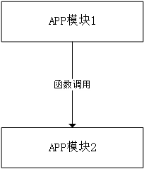

<p align="right"><font size=8 color="black"><b>Programming Guide</b></font></p>

<p align="right"><font size=5 color="black"><b>Programming Guide</b></font></p>

<p align="right"><font size=3 color="black"><b>Release V1.0</b></font></p>

---


<p align="center"><font size=3 color="black"><b>Confidental and Proprietary – Wu Qi Micro Limited</b></font></p>

<div style="page-break-after:always" />

<p align="left"><font size=6.5 color="black"><b>Copyright</b></font></p>

© 2021, Wu Qi Micro Limited. All rights reserved. 

**Disclaimer**

The contents of this document are to revision without notice due to continued progress in methodology, design and manufacturing. 

Wu Qi Micro Limited shall have no liability for any error or damage of any kind resulting from the use of this document.

**Trademark List**

All trademarks mentioned herein are the property of their respective owners. These are shown in the document Trademark Information. 

<div style="page-break-after:always" />

<p align="left"><font size=5 color="black"><b>Content</b></font></p>

[TOC]


<div style="page-break-after:always" />

<p align="left"><font size=6 color="black"><b>Revision History</b></font></p>

<table>
         <tr align="center" bgColor="a1a4a3">
             <th>Publication Date</th> 
             <th>Version</th>
             <th>Edition</th>
         </tr>
         <tr align="center">
             <td height="50">May 2019</td>
             <td>V1.0</td>
             <td>First Edition</td>
         </tr>
</table>


<div style="page-break-after:always" />

# 图片缩放后无法显示





<div style='color: red'>  
    - listitem 
    - listitem 
    - listitem  
</div>


```html
<div style='color: red'>

- listitem
- listitem
- listitem

</div>
```


<center><b>Logo</b></center>


# 代码块

```c
    IOT_ADC_WORK_MODE_SINGLE,
    IOT_ADC_WORK_MODE_MULTI_CONTINUOUS,
} IOT_ADC_WORK_MODE;
```

# List

1. ==<abbr title="World Wide Web”>WWW</abbr>== 
2. <abbr title="World Health Organization">WHO</abbr>  The <abbr title="World Health Organization">WHO</abbr> was founded in 1948.
3. <abbr title="World Wide Web">WWW</abbr>    WHO 
4. ℃   ¥   £℉↔↔↑↑↗↗╫±±××⅞￣⅞
5. –  嘎嘎嘎—海域＿＿–––︳⑩⑦⑤⑧③⑥㈤㈡㈠㈣⑩㈥㈨⒙ⅰⅱⅲⅳⅴⅵⅷⅷ
7. 注释：<!--No part of this document may be reproduced in any form without the written permission of the copyright owner.-->
7. Tab 
8. Shift+Tab 
9. 哈哈哈^基金会^
10. 永远永远~哈哈哈~
11. dfe2e5灰色
12. ⚠⚠💛💚☣☢〽 🈺🔕⚠☣☢⚜❌📛🛑⚠⚠⚠⚠

 

# HTML嵌套规则

* 块级元素：

  <div>one</div><div>two</div><div>three</div>

* 行内元素：

  <span>one</span><span>two</span>

# General Rules

## British English

## Something New

链接：

1. 网页链接：
   1. <https://www.baidu.com/>
   2. 百度 （https://www.baidu.com/）
   3. https://www.baidu.com/
   4. In general, technical manuals are written in American English. <www.intel.com> written
   5.  <a href="http://www.baidu.com/" target:_self>百度</a>  在新窗口中打开目标文件。
   6. <a href="http://www.baidu.com/" target="_blank">百度</a>  在当前窗口中打开目标文件(默认打开)，相当于“替换”操作。
   7. <a href="http://www.baidu.com/" target="_top">百度</a>  在最顶级窗口来打开目标文件。
   8. <a href="http://www.baidu.com/" target="_parent">百度</a>  在父级窗口来打开目标文件。
   9. <a href="http://www.php.cn/" >php.cn</a>
2. 本地文件：[打开文档](C:\Users\user\Desktop\f\General Rules2.assets\logo1.png)

* 一个小圆点`.`表示当前目录
  * `./LinkTest.md`表示当前目录下的LinkTest.md文件
  * `./img/LinkTest.png`表示当前目录下的img文件下的LinkTest.png文件。

* 两个小圆点`..`表示上一级


3. **页内跳转**语法：[链接文字](#标题文字)

* 跳转到[General Rules](#General Rules)
* 跳转到[List](#List)
*  <a href="file:///C:\Users\user\Desktop\f\General Rules4.assets\logo.png" target="_blank">点击查看图片</a> 绝对地址
*  <a href="General Rules4.assets/logo.png">点击查看图片</a>  相对地址
* 图片交叉引用：<a href="#figure1">图1</a>    或    [图1. Logo](#figure1) 为物骐公司标识。

4. 超链接：床前明月光 

   > 这是李白的诗句
   >
   > > 静夜思


==要高亮的文本背景会用黄色填充==

<font size=3 color="red">字体颜色为红色，大小为3</font>

<font size=3 color="violet">字体颜色为紫罗兰，大小为6</font>

<p align="center"><font size=3 color="red">字体颜色为红色，大小为3，居中</font></p>

<p align="right">右对齐</p>


<h1 align = "center">标题居中的方法</h1>

## Scannable Content

<u>The volume of content available</u> to **customers** is **overwhelming**. Part of a writer's job is to help readers find <u>what</u> *they need quickly, or recognize just as quickly when they're not where they need to be. Writing to facilitate *


<div style="background-color:#888"><b>Note: </b><p>For PIN-53, the default state of this pad is pull-down when power on the system; If it is pull-up by the external logic, the system enters the fast boot mode. For PIN-53, the default state of this pad is pull-down when power on the system; If it is pull-up by the external logic, the system enters the fast boot mode.</p></div>

1. *hi*
2. *hello*
3. *BYE*


| GND  | A Ground Signal                                              |
| ---- | ------------------------------------------------------------ |
| IA   | Analog input signal                                          |
| I    | Digital input signal                                         |
| IH   | Input signals with weak internal pull-up, to  prevent signals from floating when left open |
| IL   | Input signals with weak internal pull-down, to  prevent signals from floating when left open |
| I/O  | A digital bi-directional signal                              |
| OA   | An analog output signal                                      |
| O    | A digital output signal                                      |
| P    | A power or ground signal                                     |


# Descriptive Writing

## Content structure

`Descriptive writing gives information, not instructions. Descriptive writing can be:jkio`

- A description of an item, a product, a system, or a component, its function, how it is made and how it operates
- A text that gives general information
- A note in a procedure

### Give information gradually

~~In a descriptive text,~~ **give information gradually and make sure that each sentence contains only one topic**. If you give too much information too quickly, your text will be difficult to understand and it will be necessary for the reader to read it again.

### Use key words and phrases to organize your text logically

- ~~Key words and phrases give structure to a text. `Key words` are words that often occur in a text to connect different ideas. Key phrases have the same function.~~ 

- Such words and phrases **show how information in a text is related** and give the text a logical structure. You can also use **connecting words and phrases** to help the reader understand the **progression of ideas** in the text. 

- They function as **traffic signs** and tell the reader **if the information is new, or different, or a conclusion based on preceding facts**. 

- <!--Examples of such connecting words and phrases are-->: “and”, “but”, “thus”, “at the same time”, “as a result”, and many others.

# Write Short Sentences

Use **a maximum of 25 words** in each sentence.

<a name="figure1"></a>


<center style="color:"black"><b>图 1. Logo</b></cen></center>

## Good technical writing

Good technical writing uses short sentences for **[all types of topics (simple and complex)]()**. Short sentences make your writing stronger and easier to understand.


<center style="color:blcak;text-decoration:underline"><b>图 4-1. Pad</b></center>

# Descriptive Writing

In descriptive writing, the maximum sentence length is 25 words. This is because descriptive text is more complex than <a  href="#mcu">MCU</a> procedural text.

 <div style="page-break-after:always" />

<table border="2" width="400" height="100" bordercolor="blue" bgColor="#88cc66" cellspacing="0" cellpadding="2" rules="all"summary="日历信息">
    <caption><b>2016.10日历</b></caption>
         <tr bgColor="red" align="center">
             <th>星期日</th> 
             <th>星期一</th>
             <th>星期二</th>
             <th>星期三</th>
             <th>星期四</th>
             <th>星期五</th>
             <th>星期六</th>
         </tr>
         <tr bgColor="grey" align="center">
             <td height="50">25</td>
             <td>26</td>
             <td>27</td>
             <td>28</td>
             <td>29</td>
             <td>30</td>
             <td>1</td>
         </tr>
         <tr align="center">
             <td  height="50">2</td>
             <td>3</td>
             <td>4</td>
             <td colspan="4">5</td>
         </tr>
     </table> 


<table border="1" bordercolor="black" cellspacing="0" cellpadding="0" rules="all">
    <caption><b>表1-2 我是表格标题</b></caption>
	<tr bgColor="dfe2e5">
	    <th align="center">属性</th>
	    <th>属性值</th>
	    <th>描述</th>  
	</tr >
	<tr >
	    <td rowspan="10">type</td>
	    <td>text</td>
	    <td>单行文本输入框</td>
	</tr>
	<tr>
	    <td>password</td>
	    <td>密码输入框</td>
	</tr>
	<tr>
	    <td>radio</td>
	    <td>单选按钮</td>
	</tr>
	<tr>
	    <td>CheckBox</td>
	    <td>复选按钮</td>
	</tr>
	<tr><td>button</td>
	    <td>普通按钮</td>
	</tr>
	<tr>
	    <td>submit</td>
	    <td>提交按钮</td>
	</tr>
	<tr>
	    <td>reset</td>
	    <td>重置按钮</td>
	</tr>
	<tr>
	    <td>image</td>
	    <td>图像形式的提交按钮</td>
	</tr>
	<tr>
	    <td >file</td>
	    <td>文件域</td>
	</tr>
    <tr>
        <td>-</td>
        <td>-</td>
    </tr>
	<tr>
	    <td >name</td>
	    <td rowspan="2">用户自定义</td>
	    <td>控件名称</td>
	</tr>
	<tr>
	    <td >value</td>
	    <td >默认文本值</td>
	</tr>
	<tr>
	    <td >size</td>
	    <td >正整数</td>
	    <td >控件在页面中的显示宽度</td>
	</tr>
	<tr>
	    <td >checked</td>
	    <td >checked</td>
	    <td >定义选择控件默认被选中项</td>
	</tr>
	<tr>
	    <td >maxlength</td>
	    <td >正整数</td>
	    <td >控件允许输入的最多字符</td>
	</tr>
</table>


<b><i>This text is bold and italic</i></b>

<i><b>This text is bold and italic</b></i>

2021.6.21


<p>hello        may name is hjk HTML 会把多个连续的空格字符裁减（合并）为一个：<p>    
 <div style="page-break-after:always" /


   **Contact Us**

<table cellspacing="0" cellpadding="0" rules="all">
    <tr>
        <td><b>Website:</b></td>
        <td><b>Technical Support:</b></td>
        <td><b>Business Consultation:</b></td>
    </tr> 
    <tr>
        <td><a href="http://www.wuqi-tech.com" >www.wuqi-tech.com</a></td>
        <td><a href="mailto:support@wuqi-tech.com">support@wuqi-tech.com</td>
        <td><a href="mailto:sales@wuqi-tech.com">sales@wuqi-tech.com</td>
    </tr> 
    <tr>
        <td><b>Chongqing     Address:</b></td>
        <td><b>Shanghai     Address:</b></td>
        <td><b>Shenzhen     Address:</b></td>
    </tr>    
    <tr valign="top">
	    <td>14/F, 107 Middle Road, Xiantao Big Data Valley, Yubei District, Chongqing,  PRC.<br>Tel/Fax:  023-67682717 </td>
        <td>8/F, Building 29, No.368, Zhangjiang Road, Pudong New District, Shanghai,  PRC.  <br>Tel/Fax:  021-50806308</td>
	    <td>Room 1105, Building 2, Fangdacheng, Longzhu 4th Road, Taoyuan Street, Nanshan  District, ShenZhen, PRC.  <br>Tel/Fax:  0755-86967944</td>
	</tr>
</table>


------


<hr size="5" color="red" width="80%" noshade>


<p align="center"><font size=3 color="black"><b>© 2021, Wu Qi Micro Limited. All rights reserved.</b></font></p>

<p align="center"><font size=3 color="black"><b>No part of this document may be reproduced in any form without</b></font></p>

<p align="center"><font size=3 color="black"><b>the written permission of the copyright owner.</b></font></p>


<center style="color:blcak"><b>All rights reserved.</b></center>


<p align="right"><font size=3 color="black"><b>Doc No.: </b>3100 05 01 11 02</font></p>


<!DOCTYPE HTML>
<html>
    <head>
        <meta http-equiv="Content-Type" content="text/html; charset=utf-8">
    </head>
    <body>
     <table border="2" width="400" height="100" bordercolor="blue" bgColor="#88cc66" cellspacing="0" cellpadding="2" rules="all"summary="日历信息">
         <caption>2016.10日历</caption>
         <tr bgColor="red" align="center">
             <th>星期日</th> 
             <th>星期一</th>
             <th>星期二</th>
             <th>星期三</th>
             <th>星期四</th>
             <th>星期五</th>
             <th>星期六</th>
         </tr>
         <tr bgColor="yellow" align="center">
             <td height="50">25</td>
             <td>26</td>
             <td>27</td>
             <td>28</td>
             <td>29</td>
             <td>30</td>
             <td>1</td>
         </tr>
         <tr align="center">
             <td  height="50">2</td>
             <td>3</td>
             <td>4</td>
             <td>5</td>
             <td>6</td>
             <td>7</td>
             <td>8</td>
         </tr>
     </table> 
    </body>
</html>


<table border="2" width="400" height="100" bordercolor="blue" bgColor="#88cc66" cellspacing="0" cellpadding="2" rules="all"summary="日历信息">
         <caption>2016.10日历</caption>
         <tr align="center">
             <th>星期日</th> 
             <th>星期一</th>
             <th>星期二</th>
             <th>星期三</th>
             <th>星期四</th>
             <th>星期五</th>
             <th>星期六</th>
         </tr>
         <tr align="center">
             <td height="50">25</td>
             <td>26</td>
             <td>27</td>
             <td>28</td>
             <td>29</td>
             <td>30</td>
             <td>1</td>
         </tr>
         <tr align="center">
             <td  height="50">2</td>
             <td>3</td>
             <td>4</td>
             <td>5</td>
             <td>6</td>
             <td>7</td>
             <td>8</td>
         </tr>
     </table> 
<table border="1" width="400" height="100" bordercolor="blue" cellspacing="0" cellpadding="0" rules="all"summary="日历信息">
    <caption><b>2016.10日历</b></caption>
         <tr align="center" bgColor="dfe2e5">
             <th>星期日</th> 
             <th>星期一</th>
             <th>星期二</th>
             <th>星期三</th>
             <th>星期四</th>
             <th>星期五</th>
             <th>星期六</th>
         </tr>
         <tr align="left">
             <td height="50">25</td>
             <td>26</td>
             <td>27</td>
             <td>28</td>
             <td>29</td>
             <td>30</td>
             <td>1</td>
         </tr>
         <tr align="left">
             <td  height="50">2</td>
             <td>3</td>
             <td>4</td>
             <td>5</td>
             <td>6</td>
             <td>7</td>
             <td>8</td>
         </tr>
     </table> 


<table cellspacing="0" cellpadding="0" rules="all"summary="日历信息">
         <tr align="left">
             <th>星期日</th> 
             <th>星期一</th>
             <th>星期二</th>
             <th>星期三</th>
             <th>星期四</th>
             <th>星期五</th>
             <th>星期六</th>
         </tr>
         <tr align="left">
             <td height="50">25</td>
             <td>26</td>
             <td>27</td>
             <td>28</td>
             <td>29</td>
             <td>30</td>
             <td>1</td>
         </tr>
         <tr align="left">
             <td  height="50">2</td>
             <td>3</td>
             <td>4</td>
             <td>5</td>
             <td>6</td>
             <td>7</td>
             <td>8</td>
         </tr>
     </table>


# HTML无序列表

<div style="background-color:#888">
    <b>说明： </b><p>安装目的地有两种：local和sys。</p>
<ul>
    <li>local</li>
    <li>sys是系统指定路径，一般在/usr/相关目录下，可能需要root或sudo权限。</li>
</ul>
    <p>安装源也有两种：net和nonet。</p>
<ul>
  <li>net 指从网络安装，包括使用包管理（apt/dnf/yum等）和 wget 进行下载安装包等，可能需要 root 权限。</li>
  <li>nonet 指从本自动化安装工具目录内提供的安装包进行安装，不进行联网操作。</li>
</ul>
</div>


|    模块 | 功能简介                                                     |
| ------: | :----------------------------------------------------------- |
|      BT | 负责蓝牙模块的系统状态维护，功能实现和相应的消息处理         |
|    CONN | 蓝牙连接管理                                                 |
|     WWS | TWS状态管理                                                  |
|     EVT | 用户事件的处理，是大部分用户触发的事件的处理入口。通过调用其他模块提供的API，将事件转化成实际的动作，比如接听/挂断电话等 |
|   AUDIO | 负责音频相关的控制和处理                                     |
|    TONE | 根据不同的事件和状态，播放预定的提示音                       |
| CHARGER | 充电/充电盒相关的功能处理。包括充电，出入盒，充电仓通信等    |
|     BAT | 电池电量检测，低电报警，低电关机等                           |
|     BTN | 负责按键模块的功能实现。对用户的按键输入转化为相应的用户事件 |
|     LED | 根据不同的事件和状态，使能LED按照预期的模式进行闪灯          |
|      PM | 各种开关机流程的实现                                         |
|   INEAR | 实现出/入耳检测                                              |
|  RO_CFG | 只读配置设置                                                 |
| USR_CFG | 可读写配置                                                   |
|   ECONN | 互联互通管理，比如手机弹窗，手机app交互                      |
|     CLI | 调试接口，测试接口                                           |


HTML去掉前面的符号

<!DOCTYPE HTML>
<html>
    <head>
        <meta http-equiv="Content-Type" content="text/html; charset=utf-8">
        <title>php.cn</title>

    </head>
    <body>
        <ul>
            <li>HTML+CSS</li>
            <li>JavaScript</li>
            <li>MySQL</li>
            <li>PHP</li>
        </ul>
    </body>


## DIV标签

<div id="html">
   <h2>HTML课程</h2>
    <ol>
       <li>轻松入门HTML+CSS，掌握编程必备技能</li>
      <li>HTML 0基础入门教程</li>
       <li>HTML+CSS 轻松入门</li>
    </ol>
</div>
<div id="php">
    <h2>PHP课程</h2>
    <ul>
       <li>轻松入门PHP，踏上成为大牛的第一步</li>
       <li>php 新手入门</li>
       <li>PHP 零基础 轻松学</li>
    </ul>
</div>


## 调整某一元素的CSS

偏好设置—通用—开启调试模式。重启。右击—检查元素。

color: red

font-size: larger

> 你好   default： border-left     \#dfe2e5


# Glossary

<a name="mcu">MCU</a>			Micro Control Unit


